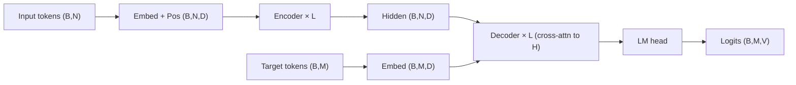
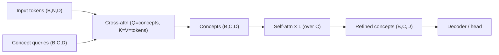
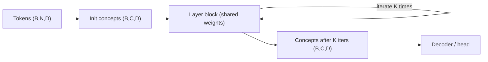
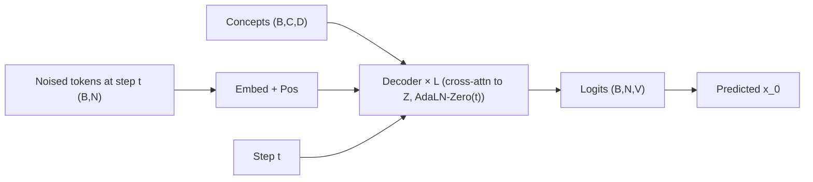
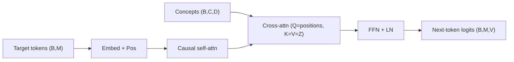

# Diagram Patterns

## Contents

- Conventions
- Encoder–Decoder
- Cross-attention bottleneck (concept tokens / Perceiver-style)
- Recursive / weight-tied encoder
- Masked diffusion decoder
- Autoregressive decoder
- ASCII shape-trace template

## Conventions

- Use **mermaid** for graph-shaped architectures, **ASCII** for tensor-shape pipelines.
- 5–15 nodes per diagram. Beyond that, split into sub-diagrams.
- Label edges that clarify intent (e.g. `cross-attn (Q=concepts, K=V=tokens)`).
- Keep shape symbols consistent across the response: `B` batch, `N` input tokens, `C` concepts, `D` model dim, `H` heads, `V` vocab, `T` diffusion steps, `K` recursive iterations.
- No LaTeX; use markdown math (`softmax(Q · Kᵀ / √d)`).

## Encoder–Decoder



## Cross-Attention Bottleneck (concept tokens / Perceiver-style)



Key property: information flows tokens → concepts, not back. Bottleneck width is `C`, scales with `N`.

## Recursive / Weight-Tied Encoder



The same layer block is applied K times. Gradients flow through all K applications, or only the last `k` if the paper uses truncated backpropagation through depth.

## Masked Diffusion Decoder



Loss is reweighted (e.g. `1/t`) and concepts condition every layer via cross-attention.

## Autoregressive Decoder



## ASCII Shape-Trace Template

```
DEFS:  B = 8 (batch), N = 512 (tokens), C = 128 (concepts),
       D = 768 (model dim), V = 32k (vocab)

(B, N)               tokens
  → embed + pos      (B, N, D)            # word + positional
  → cross-attn       (B, C, D)            # concepts query tokens (bottleneck)
  → self-attn × L    (B, C, D)            # per-concept refinement
  → norm             (B, C, D)
  → decoder x-attn   (B, N, D)            # decoder cross-attends to concepts
  → lm head          (B, N, V)            # logits
```

Keep one shape per line, one inline comment per line, max ~10 words.
