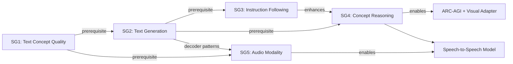
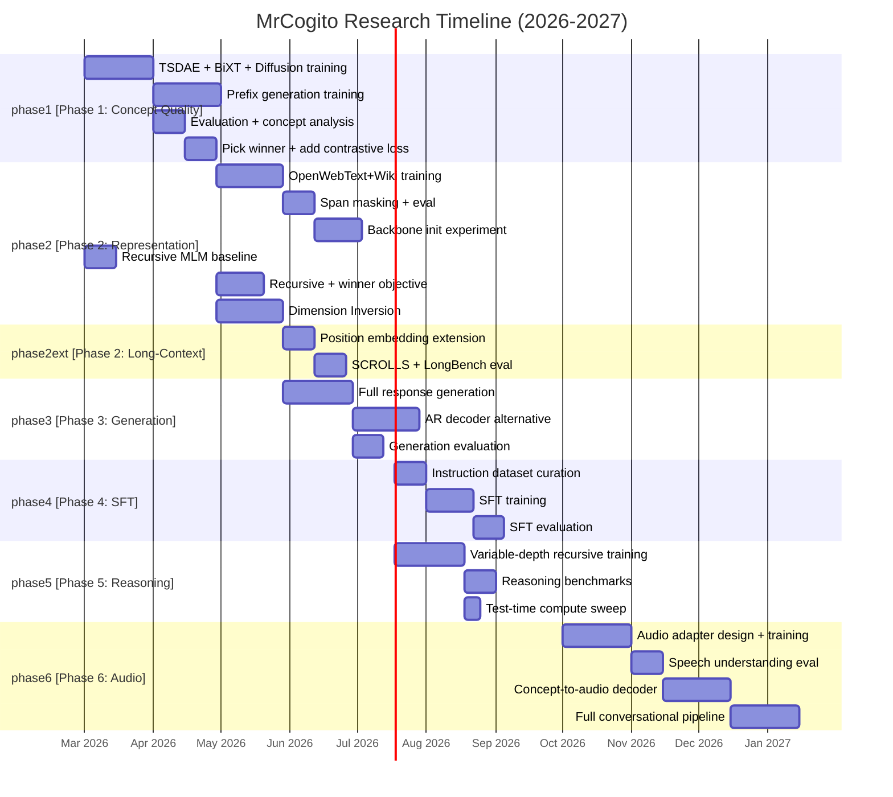

# MrCogito: Concept Encoder Research Roadmap v5

**Created:** 2026-03-01 | **Supersedes:** roadmap v4 (2026-02-26)
**Author:** Krzysztof Sopyla
**Previous versions:** v1 (2026-02-13, obsolete), v2 (2026-02-18, archived), v3 (2026-02-22, archived), v4 (2026-02-26, archived)

---

## 1. Vision and Main Goal

Build an **audio conversational and reasoning model** grounded in a **concept bottleneck** architecture. Instead of operating on raw tokens (text) or codec frames (audio), the model compresses long input sequences into dense "concept tokens," reasons iteratively in concept space, and generates output (text or speech) via a decoder.

**Full vision and goals:** [vision_and_goals.md](vision_and_goals.md)

---

## 2. Sub-Goals

### SG1: Text Concept Quality (Phases 1-2 -- prerequisite for everything)

Produce concept representations that are **semantically rich** (high downstream task performance), **geometrically diverse** (high effective rank, low pairwise similarity), and **generatively useful** (support coherent text generation from concepts). This is the critical-path blocker for all subsequent work.

**Milestone 1a (Phase 1 -- Concept Encoding Proof):** Validate that cross-attention with concepts and MLM/reconstruction objectives can form good concepts. Work mainly with encoders.
- Concept effective rank > 64/C (>50% of concept space utilized)
- STS-B Pearson > 0.70 (ViaDecoder evaluation)
- Zero-shot STS-B cosine similarity > 0.60

**Milestone 1b (Phase 2 -- Representation Excellence):** New training objectives (TSDAE, diffusion, contrastive), new architectures (recursive, BiXT, dimension inversion), data scaling. Still perceiver-type encoding with different decoding methods.
- STS-B Pearson > 0.75 (ViaDecoder evaluation)
- QQP F1 > 76%, MNLI-m > 65%
- **Prefix generation**: suffix reconstruction loss < 3.0 (concepts support generation, not just classification)

### SG2: Text Generation (Phase 3)

Transition from reconstruction to generation. Based on "good" concept representations (SG1), generate coherent text responses from concepts. Prefix generation evolves to full response generation via diffusion or autoregressive decoding.

**Success criteria:**
- Suffix perplexity on held-out data below a reasonable threshold
- Coherent multi-sentence generation from concept representations
- Generation quality competitive with similarly-sized language models

**Dependency:** SG2 only starts after SG1 Milestone 1b is met (STS-B > 0.75, prefix loss < 3.0). Concepts must demonstrably support generation before investing in a full generative pipeline.

### SG3: Instruction Following (Phase 4)

SFT on instruction data. Encode instruction via concept bottleneck, generate response. This is the bridge from "text generation model" to "useful assistant."

**Success criteria:**
- Competitive scores on instruction-following benchmarks (AlpacaEval, MT-Bench)
- Instruction-following model generates task-appropriate responses

**Dependency:** SG3 only starts after SG2 demonstrates coherent text generation from concepts.

### SG4: Concept Reasoning (Phase 5)

Demonstrate that recursive concept refinement (weight-tied encoder applied K times) enables **test-time compute scaling** -- running more iterations at inference improves performance on hard reasoning tasks, without retraining. Reasoning is positioned after generation and SFT because reasoning through generation is the target capability.

**Targets:**
- Text reasoning benchmarks (HellaSwag, CommonsenseQA, WinoGrande) as near-term proxies
- Simple reasoning early validation: ProntoQA (fictional reasoning, used by Coconut) as fast diagnostic
- ARC-AGI as long-term target (requires visual/grid input adapter)
- Recursive encoder (42M params) matches or exceeds standard encoder (61M params) on semantic benchmarks

**Training methodology (from Recurrent Depth, Geiping 2025):**
- **Variable-depth training:** randomly sample K (number of encoder iterations) per batch during training
- **Truncated backpropagation:** gradients only through final k iterations for memory efficiency
- **Standard loss:** no special reasoning annotations needed; the generation loss naturally rewards better concepts from more iterations

**Inspiration:**
- TRM (Jolicoeur-Martineau et al., 2025) -- 7M-param recursive model beats LLMs 1000x its size on ARC-AGI
- Recurrent Depth (Geiping et al., 2025) -- prelude+recurrent+coda architecture; 3.5B model matches 103B equivalent via test-time recurrence
- Coconut (Meta, 2024) -- chain of continuous thought; latent reasoning outperforms CoT; breadth-first search in concept space; multi-stage curriculum from explicit CoT to fully latent

**Dependency:** SG4 starts after SG2 (generation must work) and benefits from SG3 (SFT provides instruction-response training data for reasoning evaluation).

### SG5: Audio Conversational Model (Phase 6)

Map audio (mel-spectrograms) into the frozen text concept space via a learned adapter. Build a "Concept-Talker": encode speech into concepts, reason over them, decode back to speech.

**Architecture blueprint:**
- **Encoder side:** Speech encoder (e.g., Whisper/HuBERT features) -> concept adapter -> shared concept space
- **Reasoning:** Recursive concept encoder refines concepts (shared weights with text)
- **Decoder side:** Concept-to-audio decoder (Talker) generates speech tokens/codec frames

**Architecture references:**
- Qwen Thinker-Talker: Thinker-Talker architecture for streaming S2S (most relevant for concept encoder mapping)
- Moshi (Kyutai): Full-duplex, multi-stream, inner monologue approach for real-time conversation
- SLAM: Single-GPU recipe with synthetic data

**Dependency:** SG5 only starts after SG1 demonstrates STS-B Pearson > 0.75 on text and SG2 establishes decoder patterns. The concept space must be proven semantically useful before mapping audio into it.

---

## 3. Feasibility Assessment

### SG1: Text Concept Quality -- HIGH feasibility (2-3 months)

| Factor | Assessment |
|---|---|
| TSDAE objective | Addresses all 5 identified structural problems simultaneously. 83x stronger gradient signal per concept vs sparse MLM. |
| **Prefix generation** | SODA-inspired training: encoder sees prefix, decoder generates suffix. Forces semantic concepts because surface tokens don't transfer across segments. |
| BiXT architecture | Solves static token embeddings problem. Implemented. |
| Diffusion fixes | ELBO 1/t loss weighting + t_min=0.3 + L6 depth: low-cost fixes to existing diffusion pipeline. |
| Data scaling path | Minipile (0.6B tokens) -> OpenWebText+Wikipedia (5B+ tokens) is straightforward. |
| Hardware available | Polonez (4x RTX 3090) + Odra (3x RTX 3090) sufficient for Minipile experiments. |
| **Primary risk** | Self-reconstruction objectives may never produce concepts useful for generation/reasoning. |
| **Mitigation** | 4 parallel tracks: TSDAE (reconstruction), prefix generation (generation), diffusion fixes (controlled ablation), contrastive (semantic organization). If all fail, Slot Attention is the architectural fallback. |

### SG2: Text Generation -- MEDIUM-HIGH feasibility (3-5 months after SG1)

| Factor | Assessment |
|---|---|
| Prefix generation (A11) validated | By the time Track D starts, prefix generation will have proven concepts can support generation (suffix loss < 3.0). This de-risks full generation. |
| Diffusion decoder | Implemented and tested (`nn/concept_encoder_diffusion.py`). Cross-attention-only decoder scales to any length. |
| AR decoder alternative | Well-studied; can adapt any causal LM head conditioned on concept cross-attention. |
| **Primary risk** | Concepts may be too lossy for coherent multi-sentence generation. Compression may discard details needed for fluent output. |
| **Mitigation** | Prefix generation (A11) validates generation capability first. If diffusion fails for full generation, try AR decoder (D2). |
| **Gate** | Do not start full generation until SG1 Milestone 1b met (STS-B > 0.75, prefix loss < 3.0). |

### SG3: Instruction Following -- HIGH feasibility (2-3 months after SG2)

| Factor | Assessment |
|---|---|
| Well-studied technique | SFT on instruction data is standard practice (Alpaca, FLAN, etc.). |
| Data availability | Open instruction datasets: OpenAssistant, FLAN, Alpaca, UltraChat. |
| Architecture reuse | Same concept encoder + generative decoder from SG2. Only training data changes. |
| **Primary risk** | Concept bottleneck may lose instruction nuances (e.g., formatting requirements, multi-step instructions). |
| **Mitigation** | Start with simple single-turn instructions. Gradually increase complexity. |
| **Gate** | Do not start SFT until SG2 demonstrates coherent text generation from concepts. |

### SG4: Concept Reasoning -- MEDIUM-HIGH feasibility (4-6 months after SG2)

| Factor | Assessment |
|---|---|
| Recursive encoder | Implemented and tested (`nn/concept_encoder_recursive.py`). 47% fewer encoder params. |
| TRM precedent | Validates that recursive refinement works for abstract reasoning. |
| Text reasoning benchmarks | Achievable with current architecture once generation works. |
| ARC-AGI specifically | Requires visual/grid input adapter (not yet designed). This is an extension, not a prerequisite. |
| **Primary risk** | Weight-tying may degrade concept quality vs independent layers. |
| **Mitigation** | Warm-start from standard checkpoint. Iteration sweep (K=2..12) to find quality/compute tradeoff. |
| **Dependency** | Reasoning through generation requires SG2 (generation) to work first. Recursive encoder architecture can be validated earlier on reconstruction tasks (Track C). |

### SG5: Audio Modality -- MEDIUM feasibility (6-12 months, conditional on SG1+SG2)

| Factor | Assessment |
|---|---|
| SLAM recipe | Single-GPU training with synthetic speech data is proven. |
| Qwen architecture | Thinker-Talker maps directly to concept encoder + audio decoder. |
| Moshi approach | Full-duplex, multi-stream with inner monologue -- relevant for real-time conversation. |
| Modality adapter | Well-studied approach (Mini-Omni, AlignChat, Spirit LM). |
| **Primary risk** | Concept space may not be rich enough for speech nuances (prosody, emotion). |
| **Mitigation** | Start with speech understanding (ASR-like) before full S2S. Validate on spoken STS-B. |
| **Gate** | Do not start audio work until STS-B Pearson > 0.75, concept rank > 64/128, and SG2 decoder patterns established. |

### Overall Risk Assessment



The entire research program is **bottlenecked on SG1**. If concept quality cannot be fixed, nothing downstream is viable. The 4-track approach to SG1 (TSDAE, prefix generation, diffusion fixes, contrastive) provides sufficient diversification. The key strategic shift from v4: **explicit generation and SFT phases** (SG2, SG3) bridge the gap between concept quality and reasoning, reflecting the natural progression from reconstruction to generation to instruction-following to reasoning.

---

## 4. Current State Summary (Feb 2026)

### Best Baselines (ViaDecoder, L6 canonical checkpoint)

| Task | Score | Notes |
|---|---|---|
| MRPC F1 | **82.73%** | ViaDecoder > CLS-Query (+1.4%) |
| STS-B Pearson | **0.650** | ViaDecoder > CLS-Query (+2.3%) |
| QQP F1 | **73.35%** | ViaDecoder > CLS-Query (+0.85%) |
| MNLI-m Acc | **59.75%** | ViaDecoder > CLS-Query (+0.65%) |
| MNLI-mm Acc | **60.90%** | ViaDecoder > CLS-Query (+1.56%) |
| PAWS Acc | 57.6% | First measurement (fixed 0.1 model) |
| Concept eff. rank | **5/128 (4%)** | Severe collapse in baseline |

**Source checkpoint:** `perceiver_mlm_H512L6C128_20260208_211633` (40 epochs, Minipile)
**Full results:** [master_experiment_log.md](../2_Experiments_Registry/master_experiment_log.md), [via_decoder_eval_20260222.md](../2_Experiments_Registry/run_reports/via_decoder_eval_20260222.md)

### What Was Tried and Failed

| Approach | Outcome | Why it failed | Reference |
|---|---|---|---|
| `combined` + Kendall-Gal weighting | Rank 95.5% but GLUE crashed (QQP -13.76%, STS-B -46%) | Kendall-Gal muted MLM gradient; concepts diverse but semantically empty | [concept_losses_20260219.md](../2_Experiments_Registry/run_reports/concept_losses_20260219.md) |
| `combined` + fixed 0.1 weight | Rank 12.5%, GLUE regressed across all tasks | Combined loss cannot prevent collapse without destroying MLM | [concept_losses_20260219.md](../2_Experiments_Registry/run_reports/concept_losses_20260219.md) |
| CLS-query classification head | 128:1 information collapse | Single attention query destroys factorial concept structure | [mlm_perceiver_diagnosis_20260221.md](../4_Research_Notes/mlm_perceiver_diagnosis_20260221.md) |

| Diffusion L2 (self-reconstruction, no regularization) | Concept rank 2x better (10/128) but STS-B 0.138 (near-random) | L2 too shallow + missing ELBO weighting + self-reconstruction permits surface hashing | [diffusion_L2_eval_20260225.md](../2_Experiments_Registry/run_reports/diffusion_L2_eval_20260225.md) |

**Abandoned:** `combined` concept loss (both weighting strategies), CLS-query classification head.
**Retained:** ViaDecoder classification (now default), `t_regs_mst` regularization (untested but implemented).

**Root cause analyses:** [mlm_perceiver_diagnosis_20260221.md](../4_Research_Notes/mlm_perceiver_diagnosis_20260221.md) (5 structural misalignments in MLM+Perceiver), [diffusion_diagnosis_20260226.md](../4_Research_Notes/diffusion_diagnosis_20260226.md) (5 causes for diffusion underperformance + SoTA comparison + proposed fixes).

### Architecture Overhaul (Feb 21, 2026)

Diagnosis of 5 structural misalignments led to a complete architecture overhaul: TSDAE training, BiXT, PosOnly decoder, weighted concept pooling, separate sentence encoding. **Implementation complete, training not yet started.** See [CHANGELOG.md](../../CHANGELOG.md) `[2026-02-21]`.

---

## 5. Research Tracks

### Track A: Fix Concept Quality (Critical Path -- Phase 1)

**Goal:** Find the training objective that produces concepts with effective rank > 64/128 AND STS-B Pearson > 0.70.
**Targets SG1 Milestone 1a.** This is the highest priority. Everything else depends on it.

| ID | Experiment | Priority | Effort | Status | Dependencies |
|---|---|---|---|---|---|
| A1 | **TSDAE PosOnly** on Minipile (20 ep, H512L6C128) | HIGHEST | 5 GPU-days | Implemented, awaiting GPU | None |
| A2 | **TSDAE + BiXT** on Minipile (parallel with A1) | HIGHEST | 5 GPU-days | Implemented, awaiting GPU | None |
| A3 | **Masked Diffusion** on Minipile (warm-start from L6 MLM) | HIGH | 5 GPU-days | In progress (Polonez) | None |
| A4 | **Contrastive loss** (SimCSE-style, add to A1/A2 winner) | HIGH | 1 day code + 3 GPU-days | Not started | After A1/A2 results |
| A5 | **t_regs_mst regularization** (replace abandoned `combined`) | MEDIUM | 0.5 day code | Implemented, untested | Add to A1/A2/A3 |
| A6 | REPEAT: **ViaDecoder evaluation** on every new checkpoint | STANDARD | 0.5 day per eval | Ongoing | After each training |
| A7 | REPEAT: **Concept analysis** (eff. rank, similarity, singular values) | STANDARD | 0.5 day per run | Ongoing | After each training |
| A8 | **Zero-shot STS-B** (cosine similarity of separately-encoded sentences) | MEDIUM | 0.5 day | Not started | After A1/A2 |
| A9 | **L6 Diffusion ablation** (same config as L2 but with 6 encoder layers) | **HIGHEST** | 1 GPU-day | Not started | None |
| A10 | **Fix diffusion ELBO loss weighting** (1/t normalization) + raise t_min to 0.3 | **HIGHEST** | 0.5 day code | Not started | None |
| A11 | **Prefix generation training** (encode prefix, generate suffix via diffusion decoder) | **HIGHEST** | 3 days code + 5 GPU-days | Not started | After A9/A10 |

**Evaluation protocol for every Track A checkpoint:**
1. Concept analysis: effective rank, mean/max pairwise similarity (target: rank > 64, mean sim < 0.2)
2. GLUE with ViaDecoder: MRPC, STS-B, QQP, MNLI (target: beat current baselines)
3. GLUE with `perceiver_pair_cls`: same tasks, separate encoding (new evaluation mode)
4. Zero-shot STS-B: cosine similarity, no fine-tuning (ground truth of concept quality)
5. Beyond-GLUE: PAWS, SICK

**Detailed rationale for A9-A11:** [diffusion_diagnosis_20260226.md](../4_Research_Notes/diffusion_diagnosis_20260226.md)

**Decision gate (end of Track A):**
- If any objective produces rank > 64 AND STS-B > 0.70 -> proceed to Track B (data scaling)
- If prefix generation (A11) achieves suffix loss < 3.0, this validates generation capability regardless of STS-B
- If all objectives fail rank > 30 -> implement Slot Attention (Track C.5) before proceeding
- Pick winner based on: (1) concept rank, (2) STS-B Pearson, (3) **prefix generation quality**, (4) training stability

**Active TODOs:** [TODO 6](active_todos.md), [TODO 10-13](active_todos.md)
**Training scripts:** `training/train_tsdae.py`, `scripts/train_diffusion_multigpu.sh`

---

### Track B: Data Scaling (Phase 2)

**Goal:** Scale pretraining data from 0.6B to 5B+ effective tokens using the winning objective from Track A.
**Targets SG1 Milestone 1b.** This is the largest single expected improvement.

| ID | Experiment | Priority | Effort | Status | Dependencies |
|---|---|---|---|---|---|
| B1 | **OpenWebText + Wikipedia** (15M samples, ~33GB) with Track A winner | HIGH | 7 GPU-days | Not started | Track A winner selected |
| B2 | **Span masking** (contiguous 3-10 tokens, 30% rate) alongside B1 | HIGH | 1 day code | Not started | With B1 |
| B3 | **Backbone init from SmolLM2-135M** (or Qwen2.5-0.5B) | HIGH | 3 days code + 5 GPU-days | Not started | After B1 baseline |
| B4 | REPEAT: **Full GLUE + Beyond-GLUE** after scaling | STANDARD | 1 day | -- | After B1 |
| B5 | REPEAT: **Concept analysis + ViaDecoder eval** after scaling | STANDARD | 0.5 day | -- | After B1 |
| B6 | Scale to **FineWeb-Edu sample-10BT** if B1 insufficient | MEDIUM | 10 GPU-days | Not started | After B1 results |

**Data sources:**
- `Skylion007/openwebtext` (~8M samples, 13.5GB)
- `wikimedia/wikipedia` 20231101.en (~6.7M, 20GB)
- Fallback: `HuggingFaceFW/fineweb-edu` sample-10BT

**Training protocol for B1:**
- Architecture: Track A winner (TSDAE or diffusion + best regularization)
- Epochs: 10-15 (more data = fewer epochs needed)
- LR: 3e-4 cosine, 3000 warmup steps
- Effective batch: 512
- Target: MLM/reconstruction loss < 2.0, effective rank > 60

**Decision gate (end of Track B):**
- STS-B Pearson > 0.75 -> SG1 Milestone 1b met, proceed to Track D (generation) and Track E (long-context)
- MNLI-m > 65% -> strong signal, concepts capture compositional semantics
- STS-B < 0.70 -> try backbone init (B3) before further scaling

**Active TODO:** [TODO 7](active_todos.md)

---

### Track C: Architectural Innovations (Phase 2)

**Goal:** Test architectural variants that improve concept quality (SG1), enable reasoning (SG4), or improve efficiency.
**Targets SG1 + SG4.** These can run in parallel with Track B once Track A winner is selected.

| ID | Experiment | Priority | Effort | Status | Dependencies |
|---|---|---|---|---|---|
| C1 | **Recursive Concept Encoder** on Minipile (K=6, ~42M params, MLM) | MEDIUM | 2 GPU-days | Code done, not trained | None |
| C2 | **Recursive encoder with Track A winner** (TSDAE/diffusion) | HIGH | 3 GPU-days | Not started | Track A winner + C1 results |
| C3 | **Test-time compute scaling** sweep (K=2,4,6,8,12 on GLUE) | HIGH | 0.5 day eval | Not started | After C1 or C2 |
| C4 | **Dimension Inversion** (token_dim=32, concept_dim=512) | MEDIUM | 3 days code + 5 GPU-days | Not started | After Track A |
| C5 | **Slot Attention** encoder variant (softmax over concept dim) | MEDIUM | 3 days code + 5 GPU-days | Design complete | Fallback if Track A fails |
| C6 | **Next-Concept Prediction** (LCM-style, concept-level LM) | LOW | 5 days code + 5 GPU-days | Not started | After Track B |

**C1 training plan (Recursive MLM baseline):**
- Phase A: Minipile, 20 epochs, K=6, combined losses with fixed 0.1 (learn from past -- NOT kendall_gal)
- Phase B: Iteration sweep K=2,4,6,8,12 on GLUE (no retraining, change `model.config.num_iterations`)
- Phase C: Compare vs standard L6 on MRPC, STS-B, QQP, MNLI, PAWS, SICK
- Phase D: Warm-start from standard L6 checkpoint via `encoder.load_from_standard_checkpoint()`

**C2 (Recursive + Track A winner):** The recursive encoder must be re-trained with the winning objective, not just MLM. If TSDAE wins Track A, train `RecursiveConceptEncoderForMaskedLM` with TSDAE collator and PosOnly decoder.

**C4 rationale:** Token embedding intrinsic dimensionality is 10-37 (Tsukagoshi & Sasano, 2025). ALBERT uses 128-dim token embeddings with full GLUE performance. Cutting token_dim to 32 and keeping concept_dim=512 concentrates capacity in the concept space.

**Active TODO:** [TODO 8](active_todos.md) (C1), [TODO 9](active_todos.md) (B3/backbone init)

---

### Track D: Text Generation (Phase 3)

**Goal:** Based on proven concept representations (SG1) and validated prefix generation (A11), transition to full text generation from concepts. Generate coherent multi-sentence responses conditioned on concept representations.
**Targets SG2.** This is the critical transition from "encoder model" to "generative model."

**Prerequisite:** Track A prefix generation (A11) must demonstrate suffix loss < 3.0, proving concepts can support generation. Track D builds on that foundation.

| ID | Experiment | Priority | Effort | Status | Dependencies |
|---|---|---|---|---|---|
| D1 | **Full response generation** from concepts (diffusion decoder, full document) | HIGH | 3 days code + 5 GPU-days | Not started | A11 validated, SG1 Milestone 1b met |
| D2 | **Autoregressive generation** from concepts (alternative decoder) | MEDIUM | 5 days code + 5 GPU-days | Not started | D1 or A11 validated |
| D3 | **Generation quality evaluation** (perplexity, BLEU, human eval) | STANDARD | 2 days eval | Not started | After D1/D2 |

**Decision gate (end of Track D):**
- Generated text is coherent multi-sentence output -> SG2 validated, proceed to Track F (SFT)
- If diffusion decoder fails, try AR decoder (D2) before declaring generation infeasible

---

### Track E: Long-Context (Phase 2 extension)

**Goal:** Validate the architecture's core efficiency advantage on sequences > 1K tokens.
**Targets SG1.** This is the publication-critical efficiency argument.

| ID | Experiment | Priority | Effort | Status | Dependencies |
|---|---|---|---|---|---|
| E1 | **Extend position embeddings** to 4K+ tokens (RoPE or interpolation) | HIGH | 2 days code | Not started | Track B complete |
| E2 | **SCROLLS** evaluation (long doc QA, summarization, 1K-10K tokens) | HIGH | 2 days eval | Not started | E1 |
| E3 | **LongBench** evaluation (multilingual long-context) | MEDIUM | 1 day eval | Not started | E1 |
| E4 | **Progressive sequence length training** (512 -> 2K -> 8K) | MEDIUM | 5 GPU-days | Not started | E1 |

**Efficiency argument (the core claim):**

C scales with N to maintain quality while preserving the O(C*N) << O(N^2) advantage:

| Sequence length N | Concept count C | Concept O(C*N) | Self-attn O(N^2) | Advantage |
|---|---|---|---|---|
| 512 | 128 | 65K | 262K | 4x |
| 4,096 | 512 | 2.1M | 16.7M | **8x** |
| 32,768 | 2,048 | 67M | 1.07B | **16x** |
| 1,048,576 | 8,192 | 8.6B | 1.1T | **128x** |

At N=4K with C=512, even 50% downstream performance parity makes the efficiency story compelling. At N=1M, self-attention is impossible; concept attention remains tractable.

**Decision gate (end of Track E):**
- Competitive on SCROLLS at N=4096 with C=512 -> publish efficiency paper
- Not competitive -> increase concept count (C=1024, C=2048) or model depth

---

### Track F: Instruction Following (Phase 4)

**Goal:** SFT on instruction data. Encode instruction via concept bottleneck, generate response.
**Targets SG3.** Placeholder track -- details will be refined after SG2 (generation) is validated.

| ID | Experiment | Priority | Effort | Status | Dependencies |
|---|---|---|---|---|---|
| F1 | **Instruction-following dataset curation** (OpenAssistant, FLAN, Alpaca, UltraChat) | MEDIUM | 1 week | Not started | SG2 validated |
| F2 | **SFT training** on concept-conditioned generation | MEDIUM | 2 weeks | Not started | F1 + Track D winner |
| F3 | **Evaluation** (AlpacaEval, MT-Bench) | MEDIUM | 1 week eval | Not started | F2 |

**Gate:** Do not start F1 until Track D demonstrates coherent text generation from concepts.

---

### Track G: Reasoning (Phase 5)

**Goal:** Demonstrate that recursive concept refinement enables test-time compute scaling for reasoning tasks.
**Targets SG4.** Reasoning is positioned after generation (SG2) and SFT (SG3) because reasoning through generation is the target capability.

| ID | Experiment | Priority | Effort | Status | Dependencies |
|---|---|---|---|---|---|
| G1 | **Variable-depth recursive training** (sample K per batch, from Recurrent Depth) | HIGH | 3 days code + 5 GPU-days | Not started | SG2 validated + C2 |
| G2 | **Test-time compute scaling sweep** (K=2,4,6,8,12,24 on reasoning benchmarks) | HIGH | 1 day eval | Not started | G1 |
| G3 | **Reasoning benchmarks** (HellaSwag, CommonsenseQA, WinoGrande, ProntoQA) | MEDIUM | 2 days eval | Not started | G1 or Track D |
| G4 | **Visual/grid adapter for ARC-AGI** | LOW | 2 weeks R&D | Not started | G2 proven, long-term |

**Training methodology (from Recurrent Depth, Geiping 2025):**
- **Variable-depth training:** randomly sample K (number of encoder iterations) per batch during training
- **Truncated backpropagation:** gradients only through final k iterations for memory efficiency
- **Standard loss:** no special reasoning annotations needed; the generation loss naturally rewards better concepts from more iterations


**Decision gate:**
- K=12 beats K=6 on reasoning benchmarks -> test-time compute scaling works, SG4 validated
- Recursive encoder within 2pts of standard on GLUE -> recursive is "free" compression
- Neither -> rethink reasoning approach

---

### Track H: Audio Modality (Phase 6)

**Goal:** Map audio into the concept space and build a speech-to-speech model.
**Targets SG5.** Only starts after SG1 success criteria are met and SG2 establishes decoder patterns.

| ID | Experiment | Priority | Effort | Status | Dependencies |
|---|---|---|---|---|---|
| H1 | **Mel-spectrogram to concept adapter** design and training | MEDIUM | 2 weeks R&D | Not started | SG1 + SG2 criteria met |
| H2 | **Synthetic speech data** generation (SLAM recipe, TTS from text) | MEDIUM | 1 week | Not started | H1 designed |
| H3 | **Speech understanding** evaluation (spoken STS-B, speech NLI) | MEDIUM | 1 week | Not started | H1 trained |
| H4 | **Concept-to-audio decoder** (Talker) for speech generation | LOW | 3 weeks R&D | Not started | H3 validated |
| H5 | **Full conversational pipeline** prototype | LOW | 4 weeks | Not started | H4 |

**Architecture reference models:**
- Qwen2.5-Omni / Qwen3-Omni: Thinker-Talker architecture (most relevant for concept encoder mapping)
- Moshi (Kyutai): Full-duplex, multi-stream, inner monologue (relevant for real-time conversation)
- SLAM: Single-GPU recipe with synthetic data
- Mini-Omni / AlignChat: Lightweight adapters on frozen LLMs
- Spirit LM (Meta): Interleaved spoken/written tokens

**Detailed speech-to-speech research notes:** [concept_model_speech2speech.md](../research-notes/concept_model_speech2speech.md)

**Gate:** Do not start H1 until:
- STS-B Pearson > 0.75
- Concept effective rank > 64/128
- Text concept space demonstrably carries semantic structure (zero-shot STS-B > 0.60)
- SG2 decoder patterns established (know which decoder architecture works for generation)

---

## 6. Experiment Priority Matrix

All experiments sorted by priority, with effort estimates and dependencies.

### Immediate (Month 1-2) -- Phase 1

| # | Experiment | Track | Effort | Expected Impact | Dependencies | Status |
|---|---|---|---|---|---|---|
| 1 | **L6 Diffusion ablation** (isolate encoder depth confound) | A9 | 1 GPU-day | Most informative single experiment | None | Not started |
| 2 | **Fix ELBO loss weighting** (1/t) + t_min=0.3 in diffusion | A10 | 0.5 day code | Normalize gradient across noise levels | None | Not started |
| 3 | TSDAE PosOnly on Minipile | A1 | 5 GPU-days | Fixes all 5 structural problems | None | Awaiting GPU |
| 4 | TSDAE + BiXT on Minipile | A2 | 5 GPU-days | Adds token contextualization | None | Awaiting GPU |
| 5 | **Prefix generation training** (encode prefix, decode suffix) | A11 | 3+5 days | SODA-inspired concept quality technique | After A9/A10 | Not started |
| 6 | Concept analysis on all Track A checkpoints | A7 | 0.5 day each | Validate concept quality fix | After 1-5 | -- |
| 7 | ViaDecoder + pair_cls eval on all checkpoints | A6 | 0.5 day each | Establish new baselines | After 1-5 | -- |
| 8 | Zero-shot STS-B on best Track A model | A8 | 0.5 day | Ground truth concept quality | After 6/7 | -- |
| 9 | Diffusion vs TSDAE vs Prefix comparison, pick winner | A | 0 | Decision gate | After 6/7/8 | -- |

### Near-term (Month 3-5) -- Phase 2

| # | Experiment | Track | Effort | Expected Impact | Dependencies | Status |
|---|---|---|---|---|---|---|
| 10 | Add contrastive loss (SimCSE) to Track A winner | A4 | 1+3 days | +4pts STS-B from SimCSE literature | Winner selected | Not started |
| 11 | Scale data: OpenWebText+Wiki with winner | B1 | 7 GPU-days | Largest single improvement | Winner selected | Not started |
| 12 | Span masking (with B1) | B2 | 1 day code | Phrase-level concept encoding | With 11 | Not started |
| 13 | Recursive MLM baseline on Minipile | C1 | 2 GPU-days | Validate recursive approach | None (can start earlier) | Code done |
| 14 | Recursive encoder with Track A winner | C2 | 3 GPU-days | Recursive + best objective | Winner + C1 | Not started |
| 15 | Test-time compute scaling sweep (K=2..12) | C3 | 0.5 day | Early SG4 signal | After 13 or 14 | Not started |
| 16 | Dimension Inversion ablation | C4 | 3+5 days | Novel efficiency improvement | After Track A | Not started |
| 17 | Backbone init from SmolLM2-135M | B3 | 3+5 days | Bypass data starvation | After B1 results | Not started |
| 18 | REPEAT: Full eval after data scaling | B4/B5 | 1 day | Validate scaling gains | After 11 | -- |

### Medium-term (Month 5-7) -- Phase 3 + Long-Context

| # | Experiment | Track | Effort | Expected Impact | Dependencies | Status |
|---|---|---|---|---|---|---|
| 19 | **Full response generation** from concepts (diffusion decoder) | D1 | 3+5 days | SG2 validation | A11 validated, SG1 1b met | Not started |
| 20 | **AR generation** from concepts (alternative decoder) | D2 | 5+5 days | Decoder comparison | D1 or A11 validated | Not started |
| 21 | Generation quality evaluation | D3 | 2 days | SG2 metrics | After 19/20 | Not started |
| 22 | Extend position embeddings to 4K+ | E1 | 2 days | Enable long-context eval | Track B complete | Not started |
| 23 | SCROLLS / LongBench evaluation | E2/E3 | 3 days | Validate efficiency claim | E1 | Not started |

### Long-term (Month 7-12) -- Phases 4-6

| # | Experiment | Track | Effort | Expected Impact | Dependencies | Status |
|---|---|---|---|---|---|---|
| 24 | Instruction-following dataset curation | F1 | 1 week | SG3 entry point | SG2 validated | Not started |
| 25 | SFT training on concept-conditioned generation | F2 | 2 weeks | SG3 validation | F1 | Not started |
| 26 | SFT evaluation (AlpacaEval, MT-Bench) | F3 | 1 week | SG3 metrics | F2 | Not started |
| 27 | Variable-depth recursive training | G1 | 3+5 days | SG4 entry point | SG2 + C2 | Not started |
| 28 | Reasoning benchmarks (HellaSwag, ProntoQA, etc.) | G3 | 2 days | SG4 near-term proxy | G1 or Track D | Not started |
| 29 | Recursive reasoning K=12-24 sweep | G2 | 1 day | SG4 validation | G1 | Not started |
| 30 | Slot Attention encoder variant | C5 | 3+5 days | Architectural fix for collapse | If Track A insufficient | Design done |
| 31 | Next-Concept Prediction (LCM-style) | C6 | 5+5 days | Concept-level generation | After Track B | Not started |
| 32 | Audio adapter prototype | H1/H2 | 3 weeks | SG5 entry point | SG1 + SG2 criteria met | Not started |
| 33 | Speech understanding eval | H3 | 1 week | Validate audio concepts | H1 trained | Not started |
| 34 | Concept-to-audio decoder | H4 | 3 weeks | Speech generation | H3 validated | Not started |
| 35 | Visual adapter for ARC-AGI | G4 | 2 weeks | SG4 long-term | G2 proven | Not started |
| 36 | Full conversational pipeline | H5 | 4 weeks | SG5 completion | H4 | Not started |

---

## 7. Timeline



**Milestone summary:**

| Month | Phase | Focus | Key deliverable |
|---|---|---|---|
| **1-2** (Mar-Apr) | Phase 1 | Track A: concept quality | Winner objective selected, concept rank > 64/128 |
| **3-5** (May-Jul) | Phase 2 | Track B+C+E: scaling + architecture + long-context | STS-B > 0.75, recursive encoder validated, SCROLLS results |
| **5-7** (Jul-Sep) | Phase 3 | Track D: generation | Coherent text generation from concepts, SG2 validated |
| **7-8** (Sep-Oct) | Phase 4 | Track F: instruction following | SFT model functional, SG3 validated |
| **8-10** (Oct-Dec) | Phase 5 | Track G: reasoning | Test-time compute scaling demonstrated, SG4 validated |
| **10-12** (Dec-Feb 2027) | Phase 6 | Track H: audio | Concept-Talker prototype, publication |

---

## 8. Decision Gates

### Gate 1: Phase 1 -> Phase 2 (after Track A)

```
Effective_rank > 64/C (50% utilization)?
  YES → proceed to Track B (data scaling)
  NO, but rank > 30/C → add Slot Attention (C5), retry
  NO, rank < 30/C → fundamental rethink needed (pause all downstream)

STS-B Pearson > 0.70?
  YES → concepts capture semantics, SG1 Milestone 1a met, scale data
  NO → add contrastive loss (A4), retry with combined objective
```

### Gate 2: Phase 2 -> Phase 3 (after Track A+B)

```
STS-B Pearson > 0.75 AND MNLI-m > 65%?
  YES → SG1 Milestone 1b met
  NO → try backbone init from SmolLM2 (B3), then retry
  Still NO → consider switching to decoder-only architecture

Prefix generation (A11) suffix loss < 3.0?
  YES → concepts support generation, proceed to Track D (full generation)
  NO → self-reconstruction concepts don't generalize;
       pivot fully to prefix generation training before proceeding

Concept rank > 64/128 after scaling?
  YES → concept collapse solved, full speed ahead
  NO → scaling alone insufficient, add t_regs_mst or Slot Attention

All criteria met → proceed to Track D (generation) and Track E (long-context)
```

### Gate 3: Phase 3 -> Phase 4 (after Track D)

```
Coherent multi-sentence generation demonstrated?
  YES → SG2 validated, proceed to Track F (SFT) and Track G (reasoning)
  NO → try AR decoder (D2) if diffusion failed, or iterate on decoder architecture
```

### Gate 4: Phase 4 -> Phase 5 (after Track F)

```
Instruction-following model generates task-appropriate responses?
  YES → SG3 validated, proceed to Track G (reasoning augmentation)
  NO → iterate on SFT data mix and training
```

### Gate 5: After Track C (recursive encoder, can run in parallel)

```
Recursive K=6 within 2pts of standard L6 on GLUE?
  YES → recursive is "free" compression, use as default
  NO → weight tying hurts, keep standard encoder

K=12 beats K=6 on MNLI or reasoning tasks?
  YES → test-time compute scaling works, early SG4 signal
  NO → recursive refinement not helping on reconstruction tasks (may still help with generation)
```

### Gate 6: After Track E (long-context)

```
Competitive on SCROLLS at N=4096 with C=512?
  YES → publish efficiency paper
  NO → increase concept count (C=1024, C=2048) or model depth
```

### Gate 7: Before Phase 6 (audio)

```
STS-B Pearson > 0.75 AND concept rank > 64/128 AND zero-shot STS-B > 0.60?
  ALL YES → concept space ready
SG2 decoder patterns established?
  YES → start audio adapter (Track H)
  NO → text pipeline not ready, continue Tracks D/F
```

---

## 9. Experiments to Repeat After Improvements

Certain experiments must be re-run after engineering improvements or new training checkpoints. This list ensures nothing is forgotten.

| Experiment | Repeat when | Last run | Target improvement |
|---|---|---|---|
| **ViaDecoder GLUE evaluation** | After every new training checkpoint | 2026-02-22 (L6 baseline) | Beat current baselines |
| **Concept analysis** (eff. rank, similarity) | After every training run | 2026-02-21 (fixed 0.1 model) | Rank > 64/128 |
| **Beyond-GLUE** (PAWS, SICK) | After every new training checkpoint | 2026-02-21 (PAWS only) | PAWS > 60%, SICK relatedness > 0.60 |
| **Recursive encoder training** | Once with MLM (C1), once with Track A winner (C2) | Not yet run | Match standard encoder on GLUE |
| **Full GLUE baseline** | After data scaling (B1, B3) | 2026-02-22 | All tasks improve |
| **Zero-shot STS-B** | After every concept quality experiment | Not yet run | Cosine similarity > 0.60 |

---

## 10. Key References

| Paper | Year | Key finding | Relevance | Link |
|---|---|---|---|---|
| Large Concept Models (Meta) | 2024 | Sentence-level concept prediction works for generation | Validates concept approach at scale | [HF](https://hf.co/papers/2412.08821) |
| Recurrent Depth Reasoning (Geiping) | 2025 | Latent space reasoning outperforms token space | Justifies concept-level prediction, SG4 | [HF](https://hf.co/papers/2502.05171) |
| TRM (Jolicoeur-Martineau) | 2025 | 7M-param recursive model beats LLMs on ARC-AGI | Direct inspiration for RecursiveConceptEncoder | [HF](https://hf.co/papers/2510.04871) |
| MAE-LM (Meng et al.) | 2024 | [MASK] tokens corrupt encoder representations | Explains MLM misalignment (problem #1) | [HF](https://hf.co/papers/2302.02060) |
| TSDAE (Wang et al.) | 2021 | Denoising autoencoder for sentence embeddings | Primary training objective for Track A | [ACL](https://aclanthology.org/2021.findings-emnlp.59/) |
| SimCSE (Gao et al.) | 2021 | Contrastive learning for sentence embeddings | Contrastive objective (A4) | [HF](https://hf.co/papers/2104.08821) |
| BiXT (Hiller et al.) | 2024 | Bidirectional cross-attention for Perceiver | Fixes static token embeddings (problem #2) | [arXiv](https://arxiv.org/abs/2402.12138) |
| Should We Still Use MLM? (Gisserot-Boukhlef) | 2025 | CLM->MLM biphasic beats pure MLM | Backbone init strategy (B3) | [HF](https://hf.co/papers/2507.00994) |
| SpanBERT (Joshi et al.) | 2019 | Span masking forces phrase-level encoding | Span masking (B2) | [HF](https://hf.co/papers/1907.10529) |
| Slot Attention (Locatello et al.) | 2020 | Softmax over concept dim for specialization | Fallback encoder variant (C5) | [HF](https://hf.co/papers/2006.15055) |
| T-REGS MST (Mordacq et al.) | 2025 | MST-based uniformity detects dimensional collapse | Better regularization (A5) | [HF](https://hf.co/papers/2510.23484) |
| VICReg (Bardes et al.) | 2021 | Variance-invariance-covariance regularization | Concept collapse prevention | [HF](https://hf.co/papers/2105.04906) |
| ALBERT (Lan et al.) | 2020 | Shared transformer layers, 12M params | Weight tying precedent for recursive encoder | [arXiv](https://arxiv.org/abs/1909.11942) |
| Cramming 1568 Tokens | 2025 | 1500x compression theoretically achievable | Upper bound for concept compression | [HF](https://hf.co/papers/2502.13063) |
| Intrinsic Dimensionality (Aghajanyan) | 2020 | Token embedding intrinsic dim is 10-37 | Dimension inversion justification (C4) | [HF](https://hf.co/papers/2012.13255) |
| Token Assorted (Su et al.) | 2025 | Mixing latent + text tokens improves reasoning | Hybrid concept-token generation | [HF](https://hf.co/papers/2502.03275) |
| SLAM (Slamming) | 2025 | Train Speech-LM on single GPU in 24h | Audio training recipe (H2) | [arXiv](https://arxiv.org/abs/2502.15814) |
| Qwen2.5-Omni | 2025 | Thinker-Talker architecture for streaming S2S | Audio architecture reference (H4) | [arXiv](https://arxiv.org/abs/2503.20215) |
| Moshi (Kyutai) | 2024 | Full-duplex spoken dialogue with inner monologue | Audio architecture reference | [arXiv](https://arxiv.org/abs/2410.00037) |
| DenoSent | 2024 | Denoising + contrastive objectives are complementary | Supports combined TSDAE + SimCSE (A1+A4) | [OpenReview](https://openreview.net/pdf?id=Z1ElMM3ocz) |
| Information Bottleneck (Shwartz-Ziv) | 2017 | Training = fitting then compression | Theoretical foundation | [HF](https://hf.co/papers/1703.00810) |
| **SODA (Hudson)** | 2024 | Bottleneck diffusion for representation learning via novel view synthesis | Key insight: decoder must generate DIFFERENT content than encoder saw for semantic bottleneck | [CVPR](https://openaccess.thecvf.com/content/CVPR2024/html/Hudson_SODA_Bottleneck_Diffusion_Models_for_Representation_Learning_CVPR_2024_paper.html) |
| **Coconut (Meta)** | 2024 | Chain of continuous thought; latent reasoning outperforms CoT | Multi-stage curriculum for latent reasoning; breadth-first search in concept space | [GitHub](https://github.com/facebookresearch/coconut) |
| **LLaDA** | 2025 | Masked diffusion LLM at 8B scale; ELBO = weighted MLM losses; loss/p_mask weighting | Training objective and loss weighting reference for diffusion MLM | [arXiv](https://arxiv.org/abs/2502.09992) |
| **LLaDA 2.0** | 2025 | Scaled to 100B via AR→diffusion conversion; 3-phase block training | Scaling recipe: inherit from AR models, not train from scratch | [arXiv](https://arxiv.org/abs/2512.15745) |
| **MDLM (Sahoo)** | 2024 | Simplified ELBO for masked diffusion = weighted average of MLM losses | Principled training objective for discrete diffusion | [NeurIPS](https://proceedings.neurips.cc/paper_files/paper/2024/hash/eb0b13cc515724ab8015bc978fdde0ad-Abstract-Conference.html) |
| **Mercury (Inception)** | 2025 | Commercial dLLM; 10x faster than AR; 12-30 denoising steps | Validates diffusion generation at production scale | [arXiv](https://arxiv.org/abs/2506.17298) |
| **UL2 (Google)** | 2022 | Mixture-of-Denoisers unifies prefix LM + span corruption + CLM | Pretraining objective design for encoder-decoder | [Google Research](https://research.google/pubs/ul2-unifying-language-learning-paradigms/) |
| **Seq-VCR** | 2025 | Sequential Variance-Covariance Regularization for reasoning models | Regularize at EACH layer, not just output; 99.5% on 5x5 multiplication | [arXiv](https://arxiv.org/abs/2411.02344) |
| **Block Diffusion** | 2025 | Interpolates AR and diffusion; flexible-length generation | Hybrid generation strategy reference | [arXiv](https://arxiv.org/abs/2503.09573) |

---

*Roadmap v5 created: 2026-03-01*
*Previous version (v4): archived to `docs/5_Archive/`*
*Detailed TODO list: [active_todos.md](active_todos.md)*
*Experiment results: [master_experiment_log.md](../2_Experiments_Registry/master_experiment_log.md)*
*Next review: after Track A results (TSDAE/diffusion checkpoints evaluated)*
