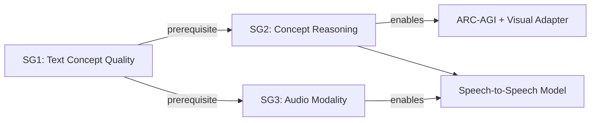
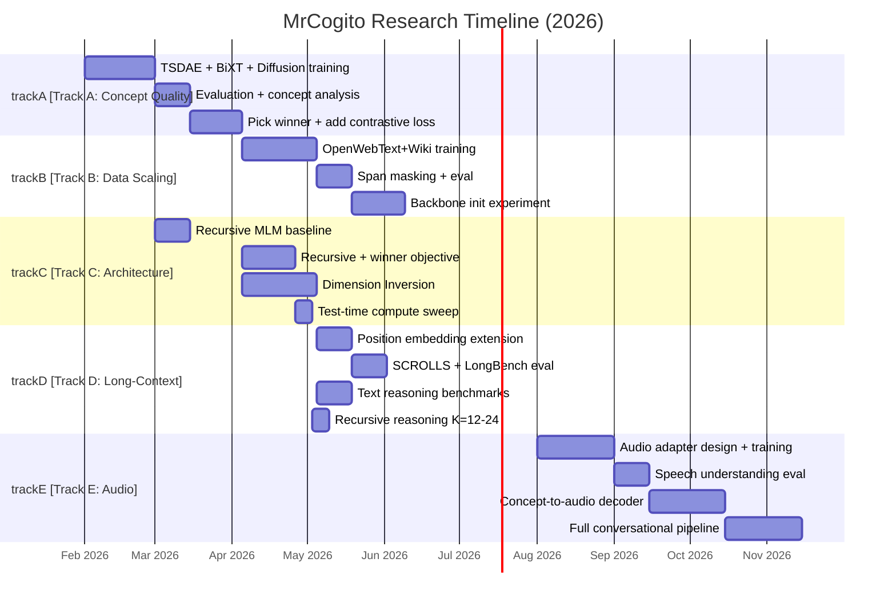

# MrCogito: Concept Encoder Research Roadmap v3

**Created:** 2026-02-22 | **Supersedes:** roadmap v2 (2026-02-18)
**Author:** Krzysztof Sopyla
**Previous versions:** v1 (2026-02-13, obsolete), v2 (2026-02-18, archived)

---

## 1. Vision and Main Goal

Build an **audio conversational and reasoning model** grounded in a **concept bottleneck** architecture. Instead of operating on raw tokens (text) or codec frames (audio), the model compresses long input sequences into a small set of dense "concept tokens" and reasons over them.

**Core architecture idea:** Cross-attention between C learned concept tokens and N input tokens produces a fixed-size semantic representation (C << N). Decoding maps concepts back to output tokens. This yields O(C*N) complexity instead of O(N^2), enabling efficient processing of long sequences and modality-agnostic reasoning.

**Publication framing:** *"Concept Bottleneck Encoder for Long-Context and Multimodal Understanding -- matching BERT on semantic tasks with 97% less compute at 4K tokens."*

---

## 2. Sub-Goals

### SG1: Text Concept Quality (prerequisite for everything)

Produce concept representations that are **semantically rich** (high downstream task performance) and **geometrically diverse** (high effective rank, low pairwise similarity). This is the critical-path blocker for all subsequent work.

**Success criteria:**
- Concept effective rank > 64/128 (>50%)
- STS-B Pearson > 0.75 (ViaDecoder evaluation)
- QQP F1 > 76%, MNLI-m > 65%
- Zero-shot STS-B cosine similarity > 0.60

### SG2: Concept Reasoning for Abstract Reasoning

Demonstrate that recursive concept refinement (weight-tied encoder applied K times) enables **test-time compute scaling** -- running more iterations at inference improves performance on hard reasoning tasks, without retraining.

**Targets:**
- Text reasoning benchmarks (HellaSwag, CommonsenseQA, WinoGrande) as near-term proxies
- ARC-AGI as long-term target (requires visual/grid input adapter, see Track D)
- Recursive encoder (42M params) matches or exceeds standard encoder (61M params) on semantic benchmarks

**Inspiration:** TRM (Jolicoeur-Martineau et al., 2025) -- 7M-param recursive model beats LLMs 1000x its size on ARC-AGI. Recurrent Depth Reasoning (Geiping et al., 2025) -- latent space reasoning outperforms token-space models.

### SG3: Audio Conversational Model

Map audio (mel-spectrograms) into the frozen text concept space via a learned adapter. Build a "Concept-Talker": encode speech into concepts, reason over them, decode back to speech.

**Architecture blueprint** (from Qwen Thinker-Talker and SLAM research):
- **Encoder side:** Speech encoder (e.g., Whisper/HuBERT features) -> concept adapter -> shared concept space
- **Reasoning:** Recursive concept encoder refines concepts (shared weights with text)
- **Decoder side:** Concept-to-audio decoder (Talker) generates speech tokens/codec frames

**Dependency:** SG3 only starts after SG1 demonstrates STS-B Pearson > 0.75 on text. The concept space must be proven semantically useful before mapping audio into it.

---

## 3. Feasibility Assessment

### SG1: Text Concept Quality -- HIGH feasibility (2-3 months)

| Factor | Assessment |
|---|---|
| TSDAE objective | Addresses all 5 identified structural problems simultaneously. 83x stronger gradient signal per concept vs sparse MLM. |
| BiXT architecture | Solves static token embeddings problem. Implemented. |
| Data scaling path | Minipile (0.6B tokens) -> OpenWebText+Wikipedia (5B+ tokens) is straightforward. |
| Hardware available | Polonez (4x A100) + Odra (3x RTX 3090) sufficient for Minipile experiments. |
| **Primary risk** | Concept collapse may be more fundamental than training objective. |
| **Mitigation** | 3 parallel objective tracks (TSDAE, diffusion, contrastive). If all fail, Slot Attention is the architectural fallback. |

### SG2: Concept Reasoning -- MEDIUM-HIGH feasibility (4-6 months)

| Factor | Assessment |
|---|---|
| Recursive encoder | Implemented and tested (`nn/concept_encoder_recursive.py`). 47% fewer encoder params. |
| TRM precedent | Validates that recursive refinement works for abstract reasoning. |
| Text reasoning benchmarks | Achievable with current architecture once concept quality is fixed. |
| ARC-AGI specifically | Requires visual/grid input adapter (not yet designed). This is an extension, not a prerequisite. |
| **Primary risk** | Weight-tying may degrade concept quality vs independent layers. |
| **Mitigation** | Warm-start from standard checkpoint. Iteration sweep (K=2..12) to find quality/compute tradeoff. |

### SG3: Audio Modality -- MEDIUM feasibility (6-12 months, conditional on SG1)

| Factor | Assessment |
|---|---|
| SLAM recipe | Single-GPU training with synthetic speech data is proven. |
| Qwen architecture | Thinker-Talker maps directly to concept encoder + audio decoder. |
| Modality adapter | Well-studied approach (Mini-Omni, AlignChat, Spirit LM). |
| **Primary risk** | Concept space may not be rich enough for speech nuances (prosody, emotion). |
| **Mitigation** | Start with speech understanding (ASR-like) before full S2S. Validate on spoken STS-B. |
| **Gate** | Do not start audio work until STS-B Pearson > 0.75 and concept rank > 64/128. |

### Overall Risk Assessment



The entire research program is **bottlenecked on SG1**. If concept quality cannot be fixed, SG2 and SG3 are not viable. The 3-track approach to SG1 (TSDAE, diffusion, contrastive) provides sufficient diversification.

---

## 4. Current State Summary (Feb 2026)

### Best Baselines (ViaDecoder, L6 canonical checkpoint)

| Task | Score | Notes |
|---|---|---|
| MRPC F1 | **82.73%** | ViaDecoder > CLS-Query (+1.4%) |
| STS-B Pearson | **0.650** | ViaDecoder > CLS-Query (+2.3%) |
| QQP F1 | **73.35%** | ViaDecoder > CLS-Query (+0.85%) |
| MNLI-m Acc | **59.75%** | ViaDecoder > CLS-Query (+0.65%) |
| MNLI-mm Acc | **60.90%** | ViaDecoder > CLS-Query (+1.56%) |
| PAWS Acc | 57.6% | First measurement (fixed 0.1 model) |
| Concept eff. rank | **5/128 (4%)** | Severe collapse in baseline |

**Source checkpoint:** `perceiver_mlm_H512L6C128_20260208_211633` (40 epochs, Minipile)
**Full results:** [master_experiment_log.md](../2_Experiments_Registry/master_experiment_log.md), [via_decoder_eval_20260222.md](../2_Experiments_Registry/run_reports/via_decoder_eval_20260222.md)

### What Was Tried and Failed

| Approach | Outcome | Why it failed | Reference |
|---|---|---|---|
| `combined` + Kendall-Gal weighting | Rank 95.5% but GLUE crashed (QQP -13.76%, STS-B -46%) | Kendall-Gal muted MLM gradient; concepts diverse but semantically empty | [concept_losses_20260219.md](../2_Experiments_Registry/run_reports/concept_losses_20260219.md) |
| `combined` + fixed 0.1 weight | Rank 12.5%, GLUE regressed across all tasks | Combined loss cannot prevent collapse without destroying MLM | [concept_losses_20260219.md](../2_Experiments_Registry/run_reports/concept_losses_20260219.md) |
| CLS-query classification head | 128:1 information collapse | Single attention query destroys factorial concept structure | [mlm_perceiver_diagnosis_20260221.md](../4_Research_Notes/mlm_perceiver_diagnosis_20260221.md) |

**Abandoned:** `combined` concept loss (both weighting strategies), CLS-query classification head.
**Retained:** ViaDecoder classification (now default), `t_regs_mst` regularization (untested but implemented).

### Root Cause: 5 Structural Misalignments in MLM+Perceiver

1. **[MASK] token pollution** -- encoder cross-attends to semantically empty [MASK] embeddings
2. **Static token embeddings** -- concept cross-attention sees uncontextualized word vectors across all 6 layers
3. **Input-embedding shortcut** -- decoder residual stream leaks token identity, killing 85% of gradient flow to concepts
4. **CLS-query collapse** -- single query compresses 128 concepts into 1 vector (fixed by ViaDecoder)
5. **GLUE mismatch** -- concatenated pair encoding conflicts with single-span pretraining

**Full analysis:** [mlm_perceiver_diagnosis_20260221.md](../4_Research_Notes/mlm_perceiver_diagnosis_20260221.md)

### Architecture Overhaul (Feb 21, 2026)

The diagnosis led to a complete architecture overhaul addressing all 5 problems:
- **TSDAE training** (token deletion, no [MASK], dense loss at all positions)
- **BiXT bidirectional cross-attention** (tokens and concepts co-evolve)
- **PosOnly decoder** (no input-embedding shortcut)
- **Weighted concept pooling** (replaces CLS-query)
- **Separate sentence encoding** for pair tasks (`perceiver_pair_cls`)

**Implementation complete.** Training not yet started. See [CHANGELOG.md](../../CHANGELOG.md) `[2026-02-21]`.

---

## 5. Research Tracks

### Track A: Fix Concept Quality (Critical Path)

**Goal:** Find the training objective that produces concepts with effective rank > 64/128 AND STS-B Pearson > 0.70.
**Targets SG1.** This is the highest priority. Everything else depends on it.

| ID | Experiment | Priority | Effort | Status | Dependencies |
|---|---|---|---|---|---|
| A1 | **TSDAE PosOnly** on Minipile (20 ep, H512L6C128) | HIGHEST | 5 GPU-days | Implemented, awaiting GPU | None |
| A2 | **TSDAE + BiXT** on Minipile (parallel with A1) | HIGHEST | 5 GPU-days | Implemented, awaiting GPU | None |
| A3 | **Masked Diffusion** on Minipile (warm-start from L6 MLM) | HIGH | 5 GPU-days | In progress (Polonez) | None |
| A4 | **Contrastive loss** (SimCSE-style, add to A1/A2 winner) | HIGH | 1 day code + 3 GPU-days | Not started | After A1/A2 results |
| A5 | **t_regs_mst regularization** (replace abandoned `combined`) | MEDIUM | 0.5 day code | Implemented, untested | Add to A1/A2/A3 |
| A6 | REPEAT: **ViaDecoder evaluation** on every new checkpoint | STANDARD | 0.5 day per eval | Ongoing | After each training |
| A7 | REPEAT: **Concept analysis** (eff. rank, similarity, singular values) | STANDARD | 0.5 day per run | Ongoing | After each training |
| A8 | **Zero-shot STS-B** (cosine similarity of separately-encoded sentences) | MEDIUM | 0.5 day | Not started | After A1/A2 |

**Evaluation protocol for every Track A checkpoint:**
1. Concept analysis: effective rank, mean/max pairwise similarity (target: rank > 64, mean sim < 0.2)
2. GLUE with ViaDecoder: MRPC, STS-B, QQP, MNLI (target: beat current baselines)
3. GLUE with `perceiver_pair_cls`: same tasks, separate encoding (new evaluation mode)
4. Zero-shot STS-B: cosine similarity, no fine-tuning (ground truth of concept quality)
5. Beyond-GLUE: PAWS, SICK

**Decision gate (end of Track A):**
- If TSDAE or diffusion produces rank > 64 AND STS-B > 0.70 -> proceed to Track B (data scaling)
- If all three objectives fail rank > 30 -> implement Slot Attention (Track C.5) before proceeding
- Pick winner based on: (1) concept rank, (2) STS-B Pearson, (3) training stability

**Active TODOs:** [TODO 6](active_todos.md), [TODO 10](active_todos.md)
**Training scripts:** `training/train_tsdae.py`, `scripts/train_diffusion_multigpu.sh`

---

### Track B: Data Scaling

**Goal:** Scale pretraining data from 0.6B to 5B+ effective tokens using the winning objective from Track A.
**Targets SG1.** This is the largest single expected improvement.

| ID | Experiment | Priority | Effort | Status | Dependencies |
|---|---|---|---|---|---|
| B1 | **OpenWebText + Wikipedia** (15M samples, ~33GB) with Track A winner | HIGH | 7 GPU-days | Not started | Track A winner selected |
| B2 | **Span masking** (contiguous 3-10 tokens, 30% rate) alongside B1 | HIGH | 1 day code | Not started | With B1 |
| B3 | **Backbone init from SmolLM2-135M** (or Qwen2.5-0.5B) | HIGH | 3 days code + 5 GPU-days | Not started | After B1 baseline |
| B4 | REPEAT: **Full GLUE + Beyond-GLUE** after scaling | STANDARD | 1 day | -- | After B1 |
| B5 | REPEAT: **Concept analysis + ViaDecoder eval** after scaling | STANDARD | 0.5 day | -- | After B1 |
| B6 | Scale to **FineWeb-Edu sample-10BT** if B1 insufficient | MEDIUM | 10 GPU-days | Not started | After B1 results |

**Data sources:**
- `Skylion007/openwebtext` (~8M samples, 13.5GB)
- `wikimedia/wikipedia` 20231101.en (~6.7M, 20GB)
- Fallback: `HuggingFaceFW/fineweb-edu` sample-10BT

**Training protocol for B1:**
- Architecture: Track A winner (TSDAE or diffusion + best regularization)
- Epochs: 10-15 (more data = fewer epochs needed)
- LR: 3e-4 cosine, 3000 warmup steps
- Effective batch: 512
- Target: MLM/reconstruction loss < 2.0, effective rank > 60

**Decision gate (end of Track B):**
- STS-B Pearson > 0.75 -> proceed to Track D (long-context)
- MNLI-m > 65% -> strong signal, ready for reasoning tasks
- STS-B < 0.70 -> try backbone init (B3) before further scaling

**Active TODO:** [TODO 7](active_todos.md)

---

### Track C: Architectural Innovations

**Goal:** Test architectural variants that improve concept quality (SG1), enable reasoning (SG2), or improve efficiency.
**Targets SG1 + SG2.** These can run in parallel with Track B once Track A winner is selected.

| ID | Experiment | Priority | Effort | Status | Dependencies |
|---|---|---|---|---|---|
| C1 | **Recursive Concept Encoder** on Minipile (K=6, ~42M params, MLM) | MEDIUM | 2 GPU-days | Code done, not trained | None |
| C2 | **Recursive encoder with Track A winner** (TSDAE/diffusion) | HIGH | 3 GPU-days | Not started | Track A winner + C1 results |
| C3 | **Test-time compute scaling** sweep (K=2,4,6,8,12 on GLUE) | HIGH | 0.5 day eval | Not started | After C1 or C2 |
| C4 | **Dimension Inversion** (token_dim=32, concept_dim=512) | MEDIUM | 3 days code + 5 GPU-days | Not started | After Track A |
| C5 | **Slot Attention** encoder variant (softmax over concept dim) | MEDIUM | 3 days code + 5 GPU-days | Design complete | Fallback if Track A fails |
| C6 | **Next-Concept Prediction** (LCM-style, concept-level LM) | LOW | 5 days code + 5 GPU-days | Not started | After Track B |

**C1 training plan (Recursive MLM baseline):**
- Phase A: Minipile, 20 epochs, K=6, combined losses with fixed 0.1 (learn from past -- NOT kendall_gal)
- Phase B: Iteration sweep K=2,4,6,8,12 on GLUE (no retraining, change `model.config.num_iterations`)
- Phase C: Compare vs standard L6 on MRPC, STS-B, QQP, MNLI, PAWS, SICK
- Phase D: Warm-start from standard L6 checkpoint via `encoder.load_from_standard_checkpoint()`

**C2 (Recursive + Track A winner):** The recursive encoder must be re-trained with the winning objective, not just MLM. If TSDAE wins Track A, train `RecursiveConceptEncoderForMaskedLM` with TSDAE collator and PosOnly decoder.

**C4 rationale:** Token embedding intrinsic dimensionality is 10-37 (Tsukagoshi & Sasano, 2025). ALBERT uses 128-dim token embeddings with full GLUE performance. Cutting token_dim to 32 and keeping concept_dim=512 concentrates capacity in the concept space.

**Active TODO:** [TODO 8](active_todos.md) (C1), [TODO 9](active_todos.md) (B3/backbone init)

---

### Track D: Long-Context and Reasoning

**Goal:** Validate the architecture's core efficiency advantage on sequences > 1K tokens, and demonstrate concept-level reasoning capability.
**Targets SG2.** This is the publication-critical track.

| ID | Experiment | Priority | Effort | Status | Dependencies |
|---|---|---|---|---|---|
| D1 | **Extend position embeddings** to 4K+ tokens (RoPE or interpolation) | HIGH | 2 days code | Not started | Track B complete |
| D2 | **SCROLLS** evaluation (long doc QA, summarization, 1K-10K tokens) | HIGH | 2 days eval | Not started | D1 |
| D3 | **LongBench** evaluation (multilingual long-context) | MEDIUM | 1 day eval | Not started | D1 |
| D4 | **Text reasoning benchmarks** (HellaSwag, CommonsenseQA, WinoGrande) | MEDIUM | 2 days eval | Not started | Track B or C2 |
| D5 | **Concept-level reasoning** with recursive encoder at K=12-24 | HIGH | 1 day eval | Not started | C2 + C3 |
| D6 | **Visual/grid adapter for ARC-AGI** | LOW | 2 weeks R&D | Not started | C2 proven, long-term |

**Efficiency argument (the core claim):**

| Sequence length | Concept Encoder O(C*N) | BERT O(N^2) | Advantage |
|---|---|---|---|
| 512 | 65K ops | 262K ops | 4x |
| 2048 | 262K ops | 4.2M ops | 16x |
| 4096 | 524K ops | 16.7M ops | **32x** |
| 16384 | 2.1M ops | 268M ops | **128x** |

At N=4096, even 50% downstream performance parity makes the efficiency story compelling.

**ARC-AGI pathway (long-term):**
ARC-AGI is a visual/spatial abstract reasoning benchmark. Applying concepts to it requires:
1. Visual input adapter (grid -> token sequence or direct grid-to-concept mapping)
2. Recursive concept refinement at high K (test-time compute scaling)
3. Concept-level generation (predict output grid from refined concepts)

This is orthogonal to current text work and will be designed after the recursive encoder proves test-time compute scaling works on text reasoning (D4, D5).

---

### Track E: Audio Modality

**Goal:** Map audio into the concept space and build a speech-to-speech model.
**Targets SG3.** Only starts after SG1 success criteria are met.

| ID | Experiment | Priority | Effort | Status | Dependencies |
|---|---|---|---|---|---|
| E1 | **Mel-spectrogram to concept adapter** design and training | MEDIUM | 2 weeks R&D | Not started | SG1 criteria met |
| E2 | **Synthetic speech data** generation (SLAM recipe, TTS from text) | MEDIUM | 1 week | Not started | E1 designed |
| E3 | **Speech understanding** evaluation (spoken STS-B, speech NLI) | MEDIUM | 1 week | Not started | E1 trained |
| E4 | **Concept-to-audio decoder** (Talker) for speech generation | LOW | 3 weeks R&D | Not started | E3 validated |
| E5 | **Full conversational pipeline** prototype | LOW | 4 weeks | Not started | E4 |

**Architecture reference models:**
- Qwen2.5-Omni / Qwen3-Omni: Thinker-Talker architecture (most relevant)
- Moshi (Kyutai): Full-duplex, multi-stream, inner monologue
- SLAM: Single-GPU recipe with synthetic data
- Mini-Omni / AlignChat: Lightweight adapters on frozen LLMs
- Spirit LM (Meta): Interleaved spoken/written tokens

**Detailed speech-to-speech research notes:** [concept_model_speech2speech.md](../research-notes/concept_model_speech2speech.md)

**Gate:** Do not start E1 until:
- STS-B Pearson > 0.75
- Concept effective rank > 64/128
- Text concept space demonstrably carries semantic structure (zero-shot STS-B > 0.60)

---

## 6. Experiment Priority Matrix

All experiments sorted by priority, with effort estimates and dependencies.

### Immediate (Month 1-2)

| # | Experiment | Track | Effort | Expected Impact | Dependencies | Status |
|---|---|---|---|---|---|---|
| 1 | TSDAE PosOnly on Minipile | A1 | 5 GPU-days | Fixes all 5 structural problems | None | Awaiting GPU |
| 2 | TSDAE + BiXT on Minipile | A2 | 5 GPU-days | Adds token contextualization | None | Awaiting GPU |
| 3 | Masked Diffusion on Minipile | A3 | 5 GPU-days | Alternative objective validation | None | In progress |
| 4 | Concept analysis on A1/A2/A3 checkpoints | A7 | 0.5 day each | Validate concept quality fix | After 1/2/3 | -- |
| 5 | ViaDecoder + pair_cls eval on A1/A2/A3 | A6 | 0.5 day each | Establish new baselines | After 1/2/3 | -- |
| 6 | Zero-shot STS-B on best Track A model | A8 | 0.5 day | Ground truth concept quality | After 4/5 | -- |
| 7 | Diffusion vs TSDAE comparison, pick winner | A | 0 | Decision gate | After 4/5/6 | -- |

### Near-term (Month 3-4)

| # | Experiment | Track | Effort | Expected Impact | Dependencies | Status |
|---|---|---|---|---|---|---|
| 8 | Add contrastive loss (SimCSE) to Track A winner | A4 | 1+3 days | +4pts STS-B from SimCSE literature | Winner selected | Not started |
| 9 | Scale data: OpenWebText+Wiki with winner | B1 | 7 GPU-days | Largest single improvement | Winner selected | Not started |
| 10 | Span masking (with B1) | B2 | 1 day code | Phrase-level concept encoding | With 9 | Not started |
| 11 | Recursive MLM baseline on Minipile | C1 | 2 GPU-days | Validate recursive approach | None (can start earlier) | Code done |
| 12 | Recursive encoder with Track A winner | C2 | 3 GPU-days | Recursive + best objective | Winner + C1 | Not started |
| 13 | Test-time compute scaling sweep (K=2..12) | C3 | 0.5 day | Validate SG2 hypothesis | After 11 or 12 | Not started |
| 14 | Dimension Inversion ablation | C4 | 3+5 days | Novel efficiency improvement | After Track A | Not started |
| 15 | REPEAT: Full eval after data scaling | B4/B5 | 1 day | Validate scaling gains | After 9 | -- |

### Medium-term (Month 5-6)

| # | Experiment | Track | Effort | Expected Impact | Dependencies | Status |
|---|---|---|---|---|---|---|
| 16 | Backbone init from SmolLM2-135M | B3 | 3+5 days | Bypass data starvation | After B1 results | Not started |
| 17 | Extend position embeddings to 4K+ | D1 | 2 days | Enable long-context eval | Track B complete | Not started |
| 18 | SCROLLS / LongBench evaluation | D2/D3 | 3 days | Validate efficiency claim | D1 | Not started |
| 19 | Text reasoning benchmarks | D4 | 2 days | SG2 near-term proxy | Track B or C2 | Not started |
| 20 | Recursive encoder at K=12-24 for reasoning | D5 | 1 day | SG2 validation | C2 + C3 | Not started |

### Long-term (Month 7-12)

| # | Experiment | Track | Effort | Expected Impact | Dependencies | Status |
|---|---|---|---|---|---|---|
| 21 | Slot Attention encoder variant | C5 | 3+5 days | Architectural fix for collapse | If Track A insufficient | Design done |
| 22 | Next-Concept Prediction (LCM-style) | C6 | 5+5 days | Concept-level generation | After Track B | Not started |
| 23 | Audio adapter prototype | E1/E2 | 3 weeks | SG3 entry point | SG1 criteria met | Not started |
| 24 | Speech understanding eval | E3 | 1 week | Validate audio concepts | E1 trained | Not started |
| 25 | Concept-to-audio decoder | E4 | 3 weeks | Speech generation | E3 validated | Not started |
| 26 | Visual adapter for ARC-AGI | D6 | 2 weeks | SG2 long-term | C2 proven | Not started |
| 27 | Full conversational pipeline | E5 | 4 weeks | SG3 completion | E4 | Not started |

---

## 7. Timeline



**Milestone summary:**

| Month | Focus | Key deliverable |
|---|---|---|
| **1-2** (Mar-Apr) | Track A: concept quality | Winner objective selected, concept rank > 64/128 |
| **3-4** (May-Jun) | Track B: data scaling + Track C start | Scaled model, STS-B > 0.75, recursive encoder validated |
| **5-6** (Jul-Aug) | Track D: long-context + reasoning | SCROLLS results, test-time compute scaling demonstrated |
| **7-9** (Sep-Nov) | Track E.1-E.2: audio adapter | Speech-to-concept mapping working |
| **10-12** (Dec-Feb 2027) | Track E.3-E.5: full pipeline | Concept-Talker prototype, publication |

---

## 8. Decision Gates

### Gate 1: After Track A (concept quality fix)

```
TSDAE/Diffusion effective_rank > 64/128?
  YES → proceed to Track B (data scaling)
  NO, but rank > 30 → add Slot Attention (C5), retry
  NO, rank < 30 → fundamental rethink needed (pause SG2/SG3)

STS-B Pearson > 0.70?
  YES → TSDAE/diffusion is working, scale data
  NO → add contrastive loss (A4), retry with combined objective
```

### Gate 2: After Track B (data scaling)

```
STS-B Pearson > 0.75 AND MNLI-m > 65%?
  YES → proceed to Track D (long-context) AND Track E (audio)
  NO → try backbone init from SmolLM2 (B3), then retry
  Still NO → consider switching to decoder-only architecture

Concept rank > 64/128 after scaling?
  YES → concept collapse solved, full speed ahead
  NO → scaling alone insufficient, add t_regs_mst or Slot Attention
```

### Gate 3: After Track C (recursive encoder)

```
Recursive K=6 within 2pts of standard L6 on GLUE?
  YES → recursive is "free" compression, use as default
  NO → weight tying hurts, keep standard encoder

K=12 beats K=6 on MNLI or reasoning tasks?
  YES → test-time compute scaling works, SG2 validated
  NO → recursive refinement not helping, rethink reasoning approach
```

### Gate 4: After Track D (long-context)

```
Competitive on SCROLLS at N=4096?
  YES → publish efficiency paper, start Track E
  NO → profile bottleneck: concept count (128) or model depth?
       Try C=256 or C=512 concepts with long sequences
```

### Gate 5: Before Track E (audio)

```
STS-B Pearson > 0.75 AND concept rank > 64/128 AND zero-shot STS-B > 0.60?
  ALL YES → start audio adapter
  ANY NO → text concept space not ready, continue Track A/B
```

---

## 9. Experiments to Repeat After Improvements

Certain experiments must be re-run after engineering improvements or new training checkpoints. This list ensures nothing is forgotten.

| Experiment | Repeat when | Last run | Target improvement |
|---|---|---|---|
| **ViaDecoder GLUE evaluation** | After every new training checkpoint | 2026-02-22 (L6 baseline) | Beat current baselines |
| **Concept analysis** (eff. rank, similarity) | After every training run | 2026-02-21 (fixed 0.1 model) | Rank > 64/128 |
| **Beyond-GLUE** (PAWS, SICK) | After every new training checkpoint | 2026-02-21 (PAWS only) | PAWS > 60%, SICK relatedness > 0.60 |
| **Recursive encoder training** | Once with MLM (C1), once with Track A winner (C2) | Not yet run | Match standard encoder on GLUE |
| **Full GLUE baseline** | After data scaling (B1, B3) | 2026-02-22 | All tasks improve |
| **Zero-shot STS-B** | After every concept quality experiment | Not yet run | Cosine similarity > 0.60 |

---

## 10. Key References

| Paper | Year | Key finding | Relevance | Link |
|---|---|---|---|---|
| Large Concept Models (Meta) | 2024 | Sentence-level concept prediction works for generation | Validates concept approach at scale | [HF](https://hf.co/papers/2412.08821) |
| Recurrent Depth Reasoning (Geiping) | 2025 | Latent space reasoning outperforms token space | Justifies concept-level prediction, SG2 | [HF](https://hf.co/papers/2502.05171) |
| TRM (Jolicoeur-Martineau) | 2025 | 7M-param recursive model beats LLMs on ARC-AGI | Direct inspiration for RecursiveConceptEncoder | [HF](https://hf.co/papers/2510.04871) |
| MAE-LM (Meng et al.) | 2024 | [MASK] tokens corrupt encoder representations | Explains MLM misalignment (problem #1) | [HF](https://hf.co/papers/2302.02060) |
| TSDAE (Wang et al.) | 2021 | Denoising autoencoder for sentence embeddings | Primary training objective for Track A | [ACL](https://aclanthology.org/2021.findings-emnlp.59/) |
| SimCSE (Gao et al.) | 2021 | Contrastive learning for sentence embeddings | Contrastive objective (A4) | [HF](https://hf.co/papers/2104.08821) |
| BiXT (Hiller et al.) | 2024 | Bidirectional cross-attention for Perceiver | Fixes static token embeddings (problem #2) | [arXiv](https://arxiv.org/abs/2402.12138) |
| Should We Still Use MLM? (Gisserot-Boukhlef) | 2025 | CLM->MLM biphasic beats pure MLM | Backbone init strategy (B3) | [HF](https://hf.co/papers/2507.00994) |
| SpanBERT (Joshi et al.) | 2019 | Span masking forces phrase-level encoding | Span masking (B2) | [HF](https://hf.co/papers/1907.10529) |
| Slot Attention (Locatello et al.) | 2020 | Softmax over concept dim for specialization | Fallback encoder variant (C5) | [HF](https://hf.co/papers/2006.15055) |
| T-REGS MST (Mordacq et al.) | 2025 | MST-based uniformity detects dimensional collapse | Better regularization (A5) | [HF](https://hf.co/papers/2510.23484) |
| VICReg (Bardes et al.) | 2021 | Variance-invariance-covariance regularization | Concept collapse prevention | [HF](https://hf.co/papers/2105.04906) |
| ALBERT (Lan et al.) | 2020 | Shared transformer layers, 12M params | Weight tying precedent for recursive encoder | [arXiv](https://arxiv.org/abs/1909.11942) |
| Cramming 1568 Tokens | 2025 | 1500x compression theoretically achievable | Upper bound for concept compression | [HF](https://hf.co/papers/2502.13063) |
| Intrinsic Dimensionality (Aghajanyan) | 2020 | Token embedding intrinsic dim is 10-37 | Dimension inversion justification (C4) | [HF](https://hf.co/papers/2012.13255) |
| Token Assorted (Su et al.) | 2025 | Mixing latent + text tokens improves reasoning | Hybrid concept-token generation | [HF](https://hf.co/papers/2502.03275) |
| SLAM (Slamming) | 2025 | Train Speech-LM on single GPU in 24h | Audio training recipe (E2) | [arXiv](https://arxiv.org/abs/2502.15814) |
| Qwen2.5-Omni | 2025 | Thinker-Talker architecture for streaming S2S | Audio architecture reference (E4) | [arXiv](https://arxiv.org/abs/2503.20215) |
| Moshi (Kyutai) | 2024 | Full-duplex spoken dialogue with inner monologue | Audio architecture reference | [arXiv](https://arxiv.org/abs/2410.00037) |
| DenoSent | 2024 | Denoising + contrastive objectives are complementary | Supports combined TSDAE + SimCSE (A1+A4) | [OpenReview](https://openreview.net/pdf?id=Z1ElMM3ocz) |
| Information Bottleneck (Shwartz-Ziv) | 2017 | Training = fitting then compression | Theoretical foundation | [HF](https://hf.co/papers/1703.00810) |

---

*Roadmap v3 created: 2026-02-22*
*Previous version (v2): archived to `docs/5_Archive/`*
*Detailed TODO list: [active_todos.md](active_todos.md)*
*Experiment results: [master_experiment_log.md](../2_Experiments_Registry/master_experiment_log.md)*
*Next review: after Track A results (TSDAE/diffusion checkpoints evaluated)*
