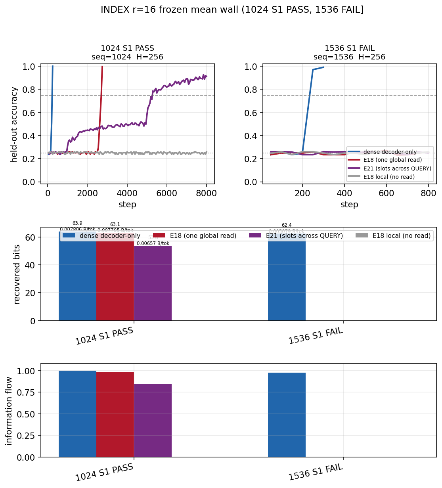
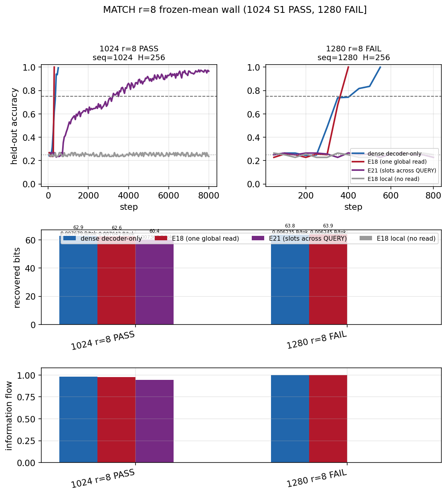
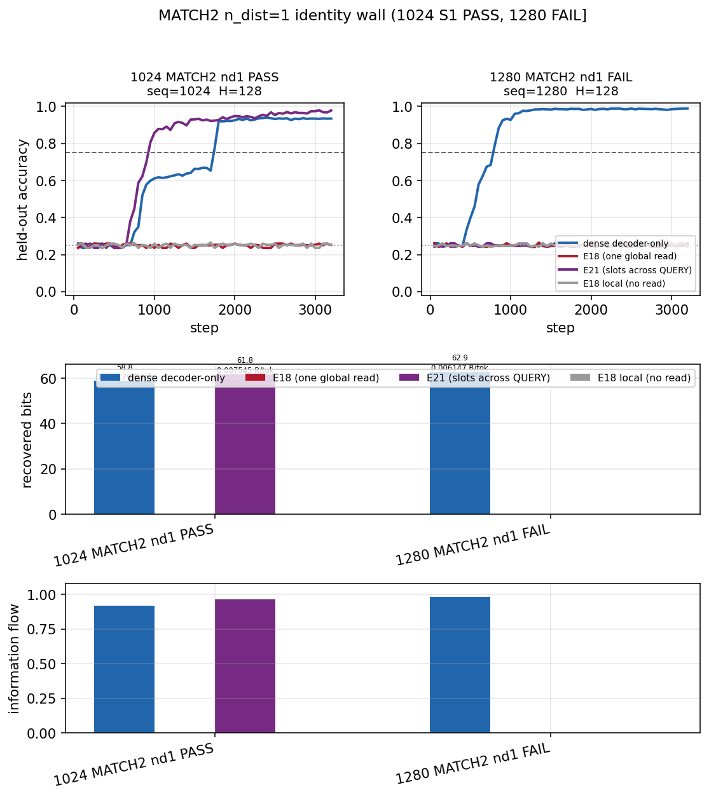
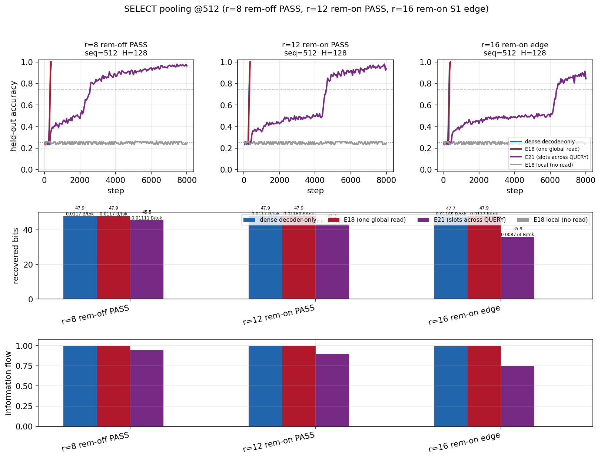
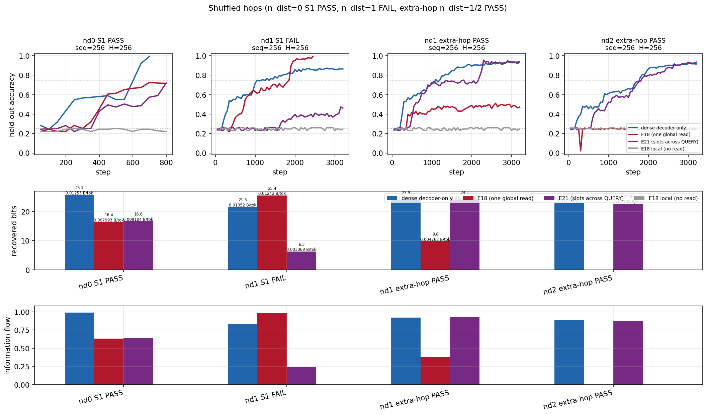
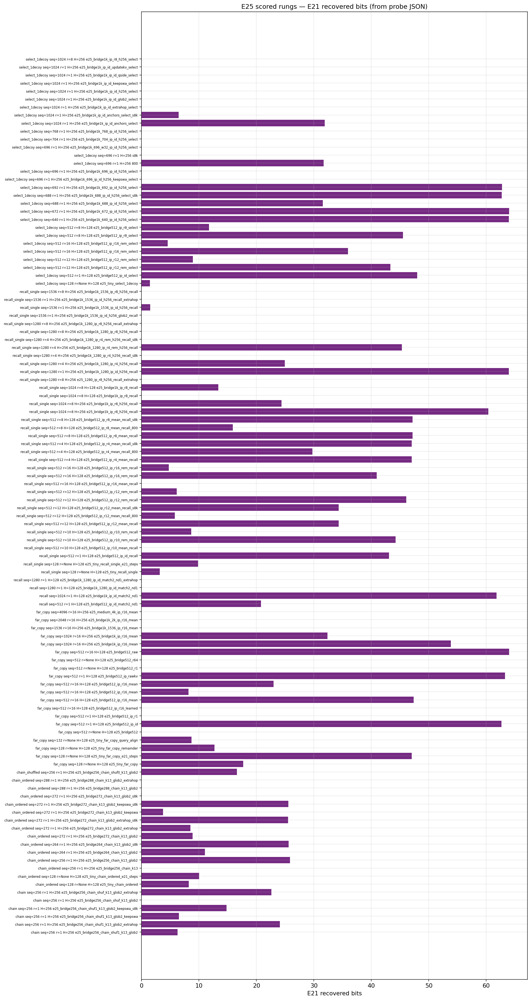

# E21 exclusive compressed read — DNA capability report

**Date:** 2026-09-16
**Spec:** [E25](../../experiments_specs/done_success/E25_e21_bapo_capability_ladder.md) (done_success, mapped)
**Code:** `nn/perceiver_ar_lm.py` (`KVCompressor`, `message_boundary_token_id`) · probe `verification/bapo_capability_probe.py`
**Ledger:** [hunt catalogue](e25_README.md) · [wall map](e25_dna_s0_ladder_mapped_20260915.md) · [bits/flow/B/tok CSV](e25_scored_rungs_bits_flow_btok.csv) · [plot index](e25_plots/README.md)

> **Verdict.** On a calibrated DNA exam with a large, exact information prize, E21’s exclusive
> compressed read **can** copy a far span and look up a planted key — but only inside a short
> length band, and **only if the compressor keeps keys**. A dense decoder-only control still
> solves every solvable row we ran. Compressing 16 tokens into one frozen mean carries copy at
> seq=1024 and smears lookup. Identity slots (`r=1`) match dense lookup at 1280 and do not
> shrink KV. We did **not** test million-token context. The 1M-context bet remains: a short
> slot tape is cheaper to attend, if the slots still hold addressable bits.

---

## 1. What was measured

Three architectures, same on-the-fly rows, models &lt;11M (typical H=256 ≈ 2.3M):

| arm | what the answer tokens may read |
|---|---|
| **dense** | full causal prefix (solvability ceiling) |
| **E18** | sliding window + one global read over **raw** prefix tokens |
| **E21** | window is cut at `QUERY`; global read sees prefix **only as compressor slots** |
| **E18-local** | window only (leak check — stayed at chance) |

E21 defaults stay off (`message_boundary_token_id=-1`) so E18 checkpoints still load. Working
E21 recipe: in-place slots, freeze the learned pooler, either frozen mean of `r` tokens or
`r=1` identity. Training the pooler with answer CE **zeroed** the channel.

A score is “pass” when E21 recovers at least 75% of **live E18 bits** in the same run (or 75%
of dense bits when E18 is ~0). Dense must itself be ≥75% accurate or we do not score E21.

Bytes-per-token in the CSV is `recovered_bits / 8 / seq_len` — information density of the
exam, not serving cost.

---

## 2. Data and tasks

**No dumped corpus.** Every batch is a fresh DNA-like row from `data/symbolic_tasks.py`
(4 content symbols + control tokens). Evidence sits farther than the sliding window, so a
local-only model is at chance by construction. Packed answers are typically **64 bits**.

| task | question | recipe we scored |
|---|---|---|
| INDEX | copy a marked far span | `far_copy` |
| MATCH | look up one planted key→value | `recall_single` |
| MATCH2 | same, plus extra facts | `recall` (`n_dist=1`; `n_dist=2` not dense-solvable at 512) |
| SELECT | real fact vs one decoy | `select_1decoy` |
| HOPS ordered | `A→B→C` in reading order | `chain_ordered` |
| HOPS shuffled | same edges shuffled (+ extra edges) | `chain_shuffled` / `chain` |

**Not scored:** Glyph family, HARD_TASKS (`unique` / `match3` / `count` / `majority`), default
multi-item `select`. Generator scales exist up to 128k; **E21 scoring used 128–4096**, with
walls inside 256–1536.

---

## 3. Findings

### 3.1 Copy (INDEX) — compression works, until the same cliff as uncompressed E18

At seq=128, dense and E18 copy in a few hundred steps. E21 with 16-token means is slow: 18
bits at 2400 steps, **47 bits at 8k** (near the 47.3-bit bar).

At seq=1024, frozen means recover **53.8 bits** (91% acc @8k) vs dense 64.0 / E18 63.1. At
1536 dense still copies; **E18 and E21 both go to 0**. That wall is a one-global-read limit,
not unique to compression. 2048 and 4096 INDEX: dense copies, E21 is chance.

Learned pooling at r=16 is chance. Concatenating slots beside raw KV (early 512 recipe) is
chance; in-place identity and in-place raw KV pass — scatter is fine, values are the issue.

### 3.2 Lookup (MATCH) — compression is the killer, not “can it see the prefix”

Identity slots (`r=1`, **no** KV saving vs E18) match dense at 1280 (**63.9 bits**) and die at
1536 while dense and E18 stay at 64 bits.

Frozen means at `r=8` match dense at 1024 (**60.4 bits**) and are **0 at 1280** while E18 is
still 64 bits. At 1280, `r=4` also fails (including leftover-keep). So: **copy survives 16-token
means; lookup does not survive 4-token means at this length.**

MATCH2 (two items) identity: E21 **beats a dead E18** at 1024 (61.8 vs ~0 bits, dense 58.8) and
is chance at 1280. Three-item MATCH2 is not dense-solvable at 512.

### 3.3 SELECT — sharpest exclusive-read cliff

Dense and E18 still copy 64 bits at seq=696. E21 identity is **62.8 bits at 692** and **0 at
696**, even with local SWA left unsevered. Leftover-drop, spread align, and window 32 do not
rescue 696. Type-cue is harder than MATCH on the same pooler: at 512, r=8/r=12 pass, r=16 is a
0.016-bit miss vs E18.

1024 SELECT is dead for exclusive E21 (identity, extra hop, second global layer, anchors).

### 3.4 Hops — exclusive read needs a second attend; extra hop is hops-specific

Ordered two-edge chain at seq=256 needs **two** exclusive global layers. E21 then **beats live
E18** (25.9 vs 5.6 bits). Length: exclusive E21 passes 264, fails 272 (E18 live); extra hop
passes 272, fails 288; dense is live at 288 and not at 320.

Shuffled extra edges kill exclusive E21 (`n_dist=0` pass, `n_dist=1` fail). One extra slot
attend brings packed `n_dist=1/2` back **without** restoring SWA. The same extra hop does
**not** rescue MATCH pooling, MATCH identity, MATCH2 length, or SELECT.

### 3.5 Overview

---

## 4. Tradeoffs (E21 vs dense)

| | E21 exclusive slots | dense decoder |
|---|---|---|
| **KV for the long read** | `r=16` → ~16× fewer global slots (the 1M *bet*) | every token |
| **What we measured** | copy at 1024 under means; lookup only if you stop compressing; SELECT cliff at 696 | solves every dense-solvable exam in this set |
| **Train time** | often 8k steps where dense/E18 click in hundreds | faster on these rows |
| **Parameters** | ~2.3M at H=256, compressor is tiny | same width |
| **Leak** | window cannot see the span (by construction) | N/A |
| **1M context** | **not tested** | **not tested** |

Identity `r=1` is not a compression win: same prefix KV as E18, plus a QUERY cut that *shortens*
SELECT and hops. Frozen `r=16` is the compression win, and it is an INDEX channel, not a MATCH
channel. Learned `u`/`delta` is a third option that failed.

---

## 5. What this does *not* say

- It does not say E21 will (or will not) handle 1M tokens.
- It does not say slots help language modeling. This exam pays ~64 bits; natural-text far
  context in E22 paid ~0.05 nats.
- Glyph, HARD_TASKS, and 16k+ DNA rungs are untested for E21.
- Passing INDEX at 1024 does not license MATCH at 1024 under the same pooler without a new
  measurement (we did that measurement: r=8 MATCH passes 1024, fails 1280).

---

## 6. Where to work next

Ordered by “this wall is real and blocking the compression bet,” not by ease.

1. **A compressor that keeps keys.** Frozen mean copies and smears. Identity does not compress.
   Learned mean dies. The missing object is a slot that is still *addressable* after pooling
   (content-keyed write, type-marked slots, attention pool with a frozen key, or one slot per
   fact rather than per 16 tokens). Kill: MATCH at seq=1280, r≥4, E21 bits ≥ 0.75 × live E18.
2. **Do not scale length until (1) passes.** 4k INDEX E21 is already 0 while dense copies.
   Million-token serving is a KV story that is idle until lookup survives compression at 1k.
3. **SELECT 692 vs 696.** Four filler tokens after BOS move QUERY and leftover vs the 32-token
   pack. Packing knobs failed. This looks like an exclusive-mask / leftover geometry bug, not
   “SELECT is impossible.” Worth a generator-or-mask fix, one experiment.
4. **INDEX 1536 is also E18-dead.** If the one-global-read tape cannot copy at 1536 even with
   raw keys, adding compression cannot help. Next INDEX work is more global capacity (or a
   different read), not a smaller `r`.
5. **Extra hop stays a hops tool.** Evidence: composition pass, MATCH/SELECT fail. Do not turn
   `--message_extra_slot_attends` on by default.
6. **Keep pooler frozen until there is an auxiliary write loss.** Answer CE alone trains a
   document-mean. A slot-level reconstruction or key-classification loss is the natural next
   training idea — one change, dense+E18 control, MATCH recipe.
7. **Transfer exams after (1).** Glyph (typed vocab, Markov filler) and a language mix are
   the right *second* instrument, not a substitute for DNA MATCH-under-compression.
8. **Leave HARD_TASKS and default `select` alone** until dense ≥75% on those recipes (they
   currently are not).

---

## 7. Pointers

- Hunt-by-hunt reports (append-only, do not rewrite): [e25_README.md](e25_README.md)
- Wall numbers: [e25_plots/metrics.md](e25_plots/metrics.md)
- Stop-resolution map: [e25_dna_s0_ladder_mapped_20260915.md](e25_dna_s0_ladder_mapped_20260915.md)
- S2 fill / CSV completeness: [e25_original_objective_completion_audit_20260915.md](e25_original_objective_completion_audit_20260915.md)
