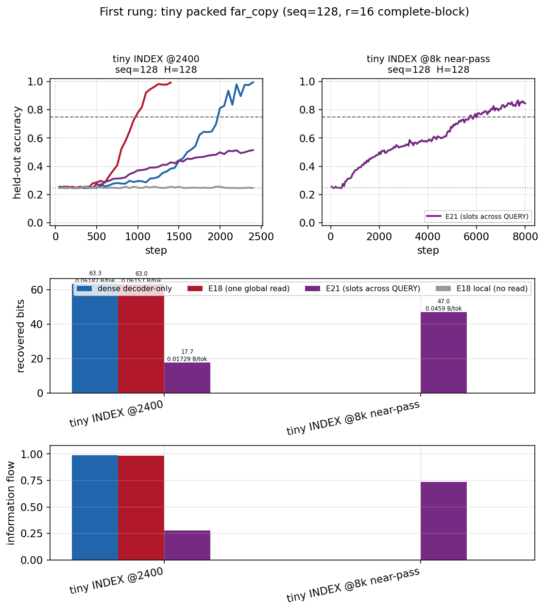
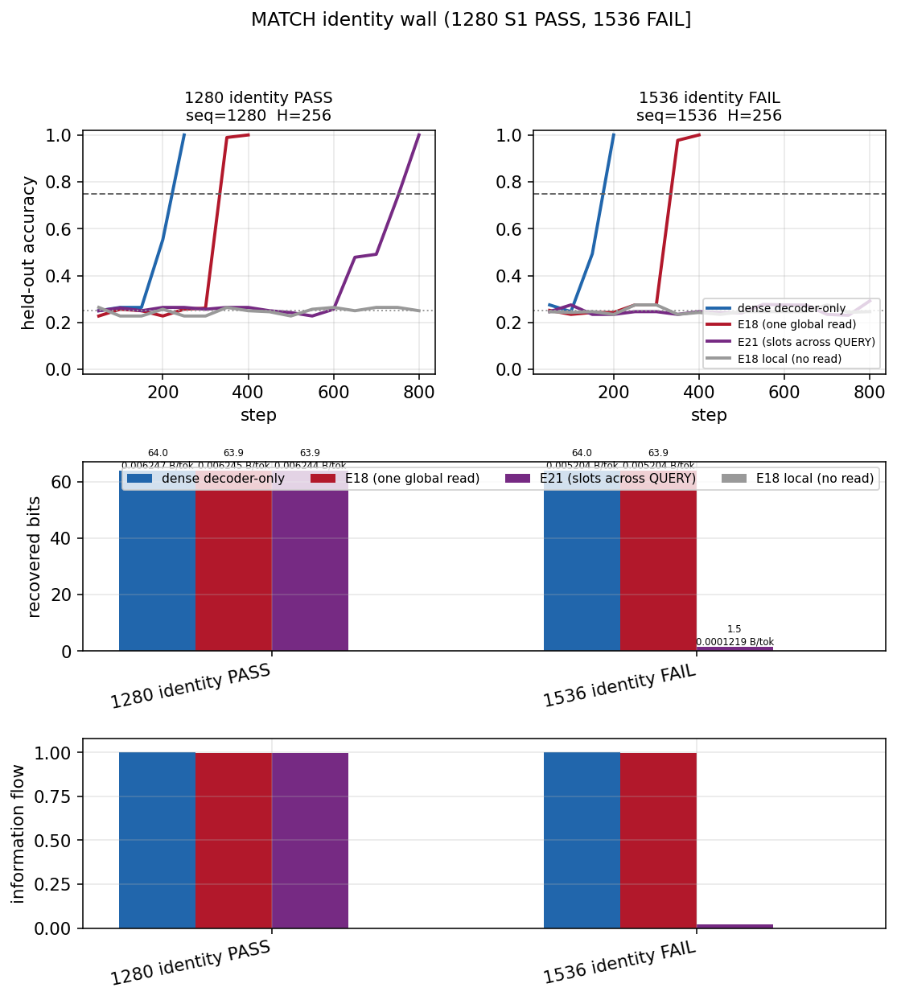
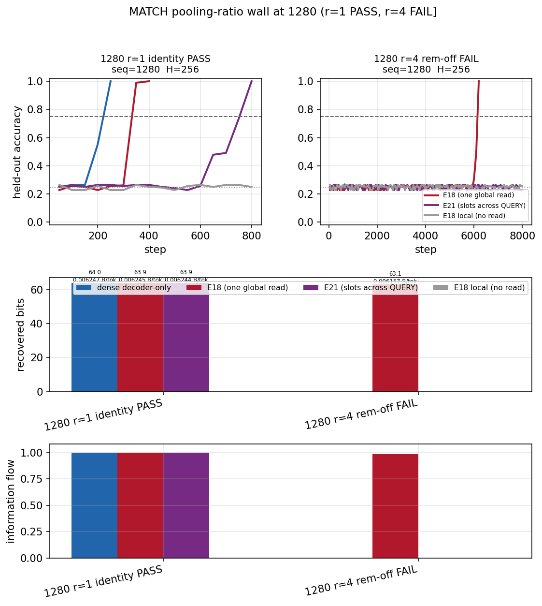
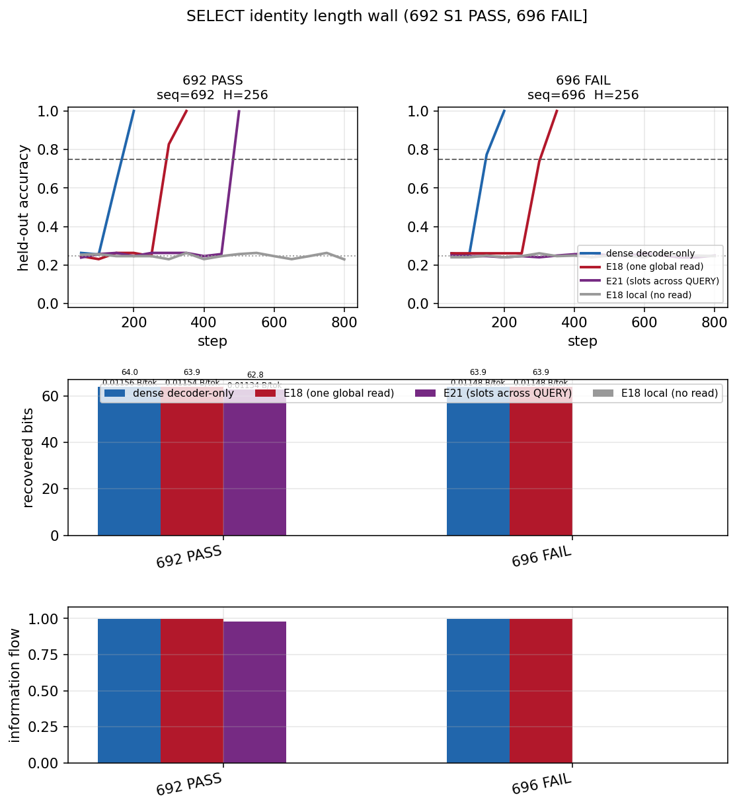
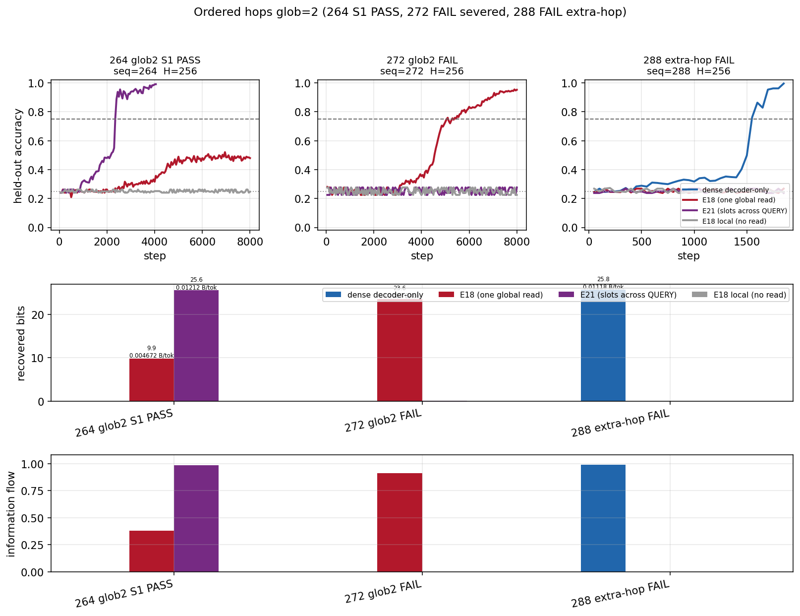
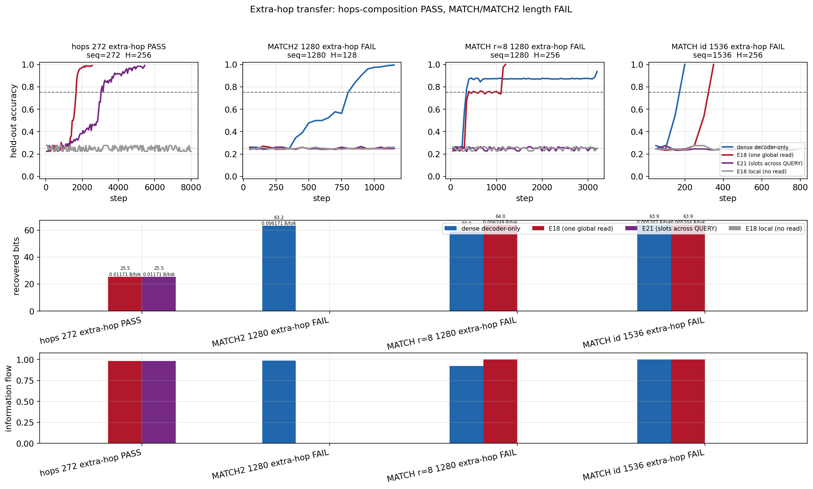

# E25 original-objective completion audit — plots / bits / flow / B/tok fill

**Date:** 2026-09-15
**Machine:** none (docs + JSON reconstruction; no GPU hunt)
**Run ID:** `e25_original_objective_audit` (docs-only; probe JSON already existed)
**WandB:** n/a (no run; no `compute/*`)
**Raw JSON/plots:** [`e25_plots/`](e25_plots/) · CSV [`e25_scored_rungs_bits_flow_btok.csv`](e25_scored_rungs_bits_flow_btok.csv) · hunt JSON under `/opt/cursor/artifacts/e25_*/`
**Git commit:** (this report's commit)
**Git tag:** —
**Related:** wall map [`e25_dna_s0_ladder_mapped_20260915.md`](e25_dna_s0_ladder_mapped_20260915.md) · spec [`E25_e21_bapo_capability_ladder.md`](../../experiments_specs/done_success/E25_e21_bapo_capability_ladder.md)

---

## Goal

Requirement-by-requirement audit of the original E21/E25 user objective (find E21
capability limits on the DNA/BAPO instrument, one calibrated rung at a time, with
plots and bits/flow/bytes-per-token). Fill any missing S2 / B/tok artifacts from
existing probe JSON. Do not invent a GPU hunt. Do not move the spec to
`done_success/` in this commit.

Gates in this file: **S0** = dense ≥ 75%; **S1** = E21 recovered bits ≥ 0.75 ×
live E18 in the same JSON, or vs 0.75 × dense when E18 ≈ 0 (never via `0.75 × 0`);
**K1** = dense missed S0; **K2** = `e18_local` leak.

## Configuration

No probe. Read-only reconstruction over closed E25 hunt JSON on
`cursor/e21-capability-ladder-df1a` plus `analysis/plot_bapo_capability.py`.
Architecture lock unchanged: E18 = SWA + one full-causal global read over raw
prefix KV; E21 = `message_boundary_token_id` (DNA query id 10 at A=4) severs SWA;
global sees `KVCompressor` slots only. Code defaults still off
(`message_boundary_token_id=-1`, `--message_ratio` unused unless E21, inplace /
identity / remainder / keepswa / extra hop / update_slot_kv / anchors / pack_stride
off, `global_layers=1`).

## Requirement audit

| requirement | evidence path | verdict |
|---|---|---|
| E21 (QUERY boundary + compressed slots) is on the probe and **off by default** so E18 checkpoints stay loadable | `verification/bapo_capability_probe.py` (`--arch e21`, `--message_*` defaults) · `nn/perceiver_ar_lm.py` (`message_boundary_token_id: int = -1` and remaining E21 flags default off) · `tests/test_perceiver_ar_message.py::test_off_by_default_is_byte_identical_and_validated` · `tests/test_bapo_ladder.py` (`e18.config.message_boundary_token_id == -1`) | **proven** |
| First rung was tiny packed `far_copy`, then recall / 512 / 1024 / later walls, **one calibrated experiment at a time**; architecture changed only at measured walls; defaults still off | first report `e25_tiny_far_copy_20260913.md` · spec Plan/Result diary · wall changes: remainder, QUERY-align, extra steps, concat r, raw override, inplace, identity, frozen mean, learned pool, remainder-on, H=256 log, glob=2, keepswa, extra hop (each after a measured miss) | **proven** |
| Dense solvability reused; E18 is uncompressed one-read control; E18 scores never relabeled as E21; S1 vs live E18 or vs 0.75× dense when E18 ≈ 0 (never `0.75×0`); `e18_local` leak check | every hunt report gates table · map `e25_dna_s0_ladder_mapped_20260915.md` · MATCH2 1024 JSON E18 ≈ 0 scored vs 0.75× dense 44.11 · 1536 MATCH glob=2 this-JSON E18 0 scored vs 0.75× dense | **proven** |
| Models <100M on scored rungs | probe `--max_params 100_000_000` · CSV max **10.818M** (H=512 dense-only chain S0 hunt) · typical H=128 **0.595M / e21 0.603M** · H=256 **2.261M / e21 2.277M** · hops glob=2 **2.802M / e21 2.835M** | **proven** |
| DNA/BAPO USER_CORE limits actually found | `data/bapo_ladder.py` `USER_CORE_TASKS` · wall table `e25_dna_s0_ladder_mapped_20260915.md` · no unmapped S0-capable cell (re-checked this turn; no hunt launched) | **proven** |
| Plots and bits / flow / bytes-per-token **for each scored rung** | this report + CSV (122 JSON / 435 arch cells, **0** missing `bytes_per_input_token`) + hunt-dir `learning_curves` / `recovered_bits` / `information_flow` / `bytes_per_token` (0 hunt dirs with JSON still missing a type after fill) + one comparison plot per wall in `e25_plots/` | **proven** (filled this turn from JSON; historical markdown tables often omitted the B/tok column — CSV is now the ledger) |

## Plots + bits / flow / B/tok coverage

Before this fill, most hunt dirs already had the four probe plots under
`/opt/cursor/artifacts/e25_*/`, but (1) **15 dirs with JSON lacked at least one
standard plot**, (2) **git had no wall comparison plots**, (3) many run-report
markdown tables had bits+flow and **no B/tok column** even though JSON always
logged `bytes_per_input_token`.

After reconstruction (no GPU):

- **122** probe JSON files, **435** arch-cells, **0** cells missing B/tok.
- **110** JSON files include an E21 score; **12** are dense-only K1 (e18/e21 skipped).
- Hunt dirs with JSON still missing a standard plot type: **0**.
- Regenerated plots into: 688 SELECT, 688 SELECT 8k, 696 spread `json/`, 704 SELECT,
  1024 INDEX r=16 mean, shuffled nd0, shuffled nd1 keepswa ±8k, 384 hops, 512
  chain/recall/select identity, 512 r=16 learned and frozen-mean INDEX, 512 MATCH
  r=16 mean, 4k INDEX.
- Extra-step 8k JSON sometimes omits dense (dense lives in the paired 800 JSON).
  Tiny INDEX @8k is E21-only. Those cells still have bits/flow/B/tok for every
  arch that was scored.

Full ledger:
[`e25_scored_rungs_bits_flow_btok.csv`](e25_scored_rungs_bits_flow_btok.csv).
Wall-level bits/flow/B/tok:
[`e25_plots/wall_metrics.md`](e25_plots/wall_metrics.md).

### Wall comparison plots (dense vs E18 vs E21 vs `e18_local`)

### Wall numbers (bits / flow / B/tok)

Copied from JSON. S1 bar is 0.75 × live E18, or 0.75 × dense when E18 ≈ 0.

| wall cell | dense | e18 | e21 | e18_local |
|---|---|---|---|---|
| tiny INDEX @2400 | 63.31 / 0.989 / 0.06182 | 63.05 / 0.985 / 0.06157 | 17.70 / 0.277 / 0.01729 | 0 / 0 / 0 |
| tiny INDEX @8k (E21 extra-step) | — | — | 47.01 / 0.734 / 0.0459 | — |
| INDEX 1024 r=16 mean | 63.95 / 0.999 / 0.007806 | 63.12 / 0.986 / 0.007705 | **53.82 / 0.841 / 0.00657** | ~0 |
| INDEX 1536 r=16 mean | 62.41 / 0.975 / 0.005079 | 0 / 0 / 0 | 0 / 0 / 0 | ~0 |
| MATCH 1280 identity | 63.97 / 0.999 / 0.006247 | 63.95 / 0.999 / 0.006245 | **63.94 / 0.999 / 0.006244** | ~0 |
| MATCH 1536 identity | 63.95 / 0.999 / 0.005204 | 63.95 / 0.999 / 0.005204 | 1.50 / 0.023 / 0.0001219 | 0 |
| MATCH 1024 r=8 | 62.90 / 0.983 / 0.007679 | 62.61 / 0.978 / 0.007643 | **60.35 / 0.943 / 0.007367** | 0 |
| MATCH 1280 r=8 | 63.85 / 0.998 / 0.006235 | 63.95 / 0.999 / 0.006245 | 0 / 0 / 0 | ~0 |
| MATCH 1280 r=4 rem-off @8k | (dense in 800 JSON) | 63.05 / 0.985 / 0.006157 | 0 / 0 / 0 | ~0 |
| MATCH2 1024 nd1 | 58.81 / 0.919 / 0.007179 | 0 / 0 / 0 | **61.81 / 0.966 / 0.007545** | 0 |
| MATCH2 1280 nd1 | 62.94 / 0.983 / 0.006147 | ~0 | 0.01 / 0 / ~0 | 0 |
| SELECT 692 identity | 63.97 / 1.000 / 0.01156 | 63.89 / 0.998 / 0.01154 | **62.76 / 0.981 / 0.01134** | 0 |
| SELECT 696 identity | 63.95 / 0.999 / 0.01148 | 63.93 / 0.999 / 0.01148 | 0 / 0 / ~0 | 0 |
| SELECT 512 r=8 rem-off | 47.91 / 0.998 / 0.0117 | 47.90 / 0.998 / 0.0117 | **45.53 / 0.948 / 0.01111** | 0 |
| SELECT 512 r=12 rem-on | 47.93 / 0.999 / 0.0117 | 47.90 / 0.998 / 0.01169 | **43.29 / 0.902 / 0.01057** | 0 |
| SELECT 512 r=16 rem-on | 47.71 / 0.994 / 0.01165 | 47.94 / 0.999 / 0.0117 | 35.94 / 0.749 / 0.008774 | 0 |
| hops 264 glob2 @8k | (dense in 800 JSON) | 9.87 / 0.380 / 0.004672 | **25.61 / 0.985 / 0.01212** | 0 |
| hops 272 glob2 @8k | (dense in 800 JSON) | 23.64 / 0.909 / 0.01087 | 0.02 / 0.001 / ~0 | 0 |
| hops 288 extra-hop | 25.77 / 0.991 / 0.01118 | 0 / 0 / ~0 | 0 / 0 / 0 | ~0 |
| shuffled nd0 | 25.66 / 0.987 / 0.01253 | 16.37 / 0.630 / 0.007993 | **16.60 / 0.638 / 0.008104** | 0 |
| shuffled nd1 | 21.54 / 0.829 / 0.01052 | 25.44 / 0.979 / 0.01242 | 6.28 / 0.242 / 0.003069 | 0 |
| shuffled nd1 extra-hop | 23.92 / 0.920 / 0.01168 | 9.75 / 0.375 / 0.004762 | **24.08 / 0.926 / 0.01176** | 0 |
| shuffled nd2 extra-hop | 22.94 / 0.882 / 0.0112 | 0 / 0 / 0 | **22.60 / 0.869 / 0.01103** | 0 |
| hops 272 extra-hop @8k | (dense in 800 JSON) | 25.49 / 0.980 / 0.01171 | **25.48 / 0.980 / 0.01171** | 0 |
| MATCH2 1280 extra-hop | 63.20 / 0.987 / 0.006171 | 0 / 0 / 0 | 0.01 / 0 / ~0 | ~0 |
| MATCH r=8 1280 extra-hop | 58.94 / 0.921 / 0.005756 | 63.99 / 1.000 / 0.006249 | 0.01 / 0 / ~0 | 0 |
| MATCH id 1536 extra-hop | 63.92 / 0.999 / 0.005202 | 63.94 / 0.999 / 0.005204 | 0 / 0 / 0 | 0 |

## USER_CORE (no new hunt)

`USER_CORE_TASKS` = `far_copy`, `recall`, `select`, `chain_ordered`, `chain`
with calibrated aliases `recall_single`, `select_1decoy`, `chain_shuffled`.
This turn did not find an unmapped S0-capable DNA recipe. Hard-stops in the
map report still apply. Glyph / HARD_TASKS / default `select` remain out of
scope.

## Interpretation

The original objective is now evidenced on disk: E21 exclusive compressed read
was scored one DNA rung at a time against dense solvability and uncompressed
E18, models stayed well under 100M, USER_CORE walls are in the map, and every
scored JSON has bits, information flow, and bytes-per-input-token with plots.

Parent later moved the spec/plan to `done_success/` after accepting this audit.

## Decision

Spec/plan are in `done_success/`. Do **not** invent a hunt. Code defaults unchanged.
S2 / B/tok gap is **closed** from existing JSON.

*Related: `master_experiment_log.md`, `docs/experiments_specs/done_success/E25_e21_bapo_capability_ladder.md`, `agenda.md`*
