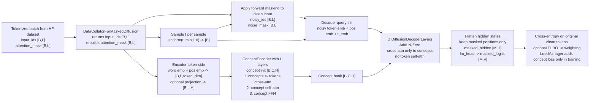
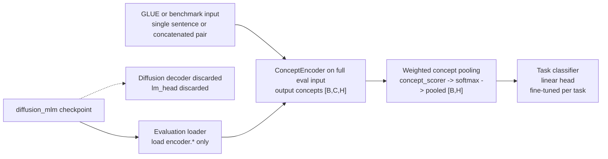
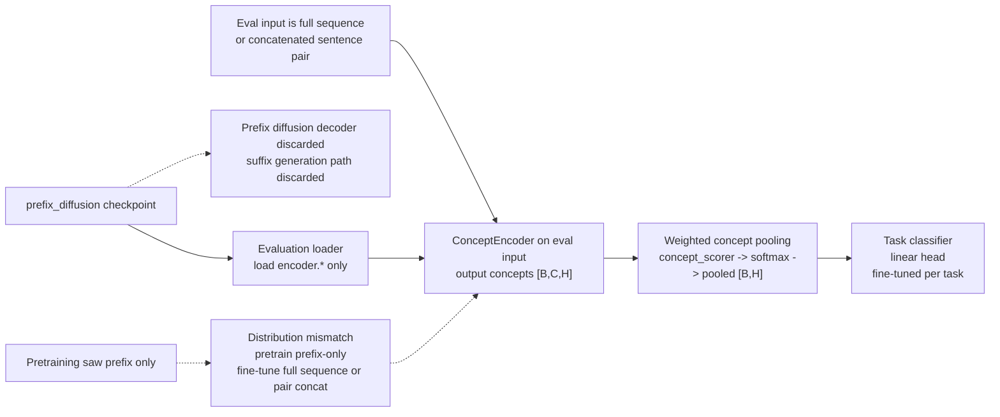

# Diffusion Failure Analysis: Why High-Expectation Runs Failed

**Date:** 2026-03-07
**Author:** Krzysztof Sopyla / AI research analysis session
**Status:** Permanent research note

**Why this report was created:**
- Recent diffusion-focused training runs did not produce the expected semantic improvements despite multiple architectural and objective changes.
- Earlier diagnoses were useful, but we needed a deeper re-derivation from the actual code paths, run artifacts, raw concept-analysis outputs, and external papers rather than relying only on prior notes.
- This report exists to separate what is now strongly supported by evidence from what remains a hypothesis, and to explain why diffusion-based training has not yet delivered the intended concept quality.

**Related previous diffusion diagnosis reports:**
- [diffusion_diagnosis_20260226.md](diffusion_diagnosis_20260226.md)
- [diffusion_elbo_deep_analysis_20260301.md](diffusion_elbo_deep_analysis_20260301.md)
- [mlm_perceiver_diagnosis_20260221.md](mlm_perceiver_diagnosis_20260221.md)

**Related experiments:**
- `diffusion_H512L2C128D2_20260223_203349`
- `diffusion_H512L6C128D2_20260226_155541`
- `diffusion_H512L6C128D2_20260301_165308`
- `prefix_diff_H512L6C128D2_20260304_200437`

**Primary code audited:**
- `training/train_diffusion.py`
- `training/train_prefix_diffusion.py`
- `nn/concept_encoder_diffusion.py`
- `nn/concept_encoder.py`
- `data/data_collators.py`
- `nn/loss_manager.py`
- `evaluation/evaluate_model_on_glue.py`
- `evaluation/evaluate_on_benchmark.py`
- `nn/concept_encoder_perceiver.py`

**Primary run evidence:**
- [active_todos.md](../1_Strategy_and_Plans/active_todos.md)
- [master_experiment_log.md](../2_Experiments_Registry/master_experiment_log.md)
- [diffusion_L2_eval_20260225.md](../2_Experiments_Registry/run_reports/diffusion_L2_eval_20260225.md)
- [diffusion_L2_failure_20260221.md](../2_Experiments_Registry/run_reports/diffusion_L2_failure_20260221.md)
- `agent_memory/concept_analysis_diffusion_L6_step20k.json`
- `agent_memory/concept_analysis_vicreg_diffusion_L6.json`
- `agent_memory/concept_analysis_prefix_diff_20260305.json`

---

## 1. Executive Summary

The central conclusion is now clearer:

**The main failure is not "diffusion does not work." The main failure is that self-reconstruction diffusion through the current concept bottleneck optimizes the wrong solution.**

In `train_diffusion.py`, the encoder sees the clean full sequence before masking. The decoder then reconstructs masked tokens by querying a compact concept bank. Under this setup, the easiest solution is not semantic abstraction but a **low-dimensional positional retrieval code** that stores token identity efficiently enough for reconstruction.

This explains the key empirical pattern:

| Run | Objective | Global rank | STS-B | Outcome |
|---|---|---:|---:|---|
| `diffusion_H512L2C128D2_20260223_203349` | self-reconstruction diffusion | 10.1 / 128 | 0.138 | geometry slightly better, semantics absent |
| `diffusion_H512L6C128D2_20260226_155541` | self-reconstruction + L6 + ELBO | 5.74 / 128 | 0.174 | deeper encoder did not fix semantics |
| `diffusion_H512L6C128D2_20260301_165308` | self-reconstruction + VICReg + t_regs_mst | 5.09 / 128 | not evaluated | regularization did not change the semantic failure |
| `prefix_diff_H512L6C128D2_20260304_200437` | prefix-to-suffix diffusion | 6.19 / 128 | 0.337 | directionally better, still collapsed and weak |

So the evidence points to two different truths:

1. **Self-reconstruction diffusion failed for a fundamental objective reason.**
2. **Prefix diffusion did not disprove the prefix idea, but the first text version is still too weak and too mismatched to force rich semantic concepts.**

---

## 2. Phase 1: Tensor Flow Diagrams

### 2.1 Masked Self-Reconstruction Diffusion



### 2.2 Prefix-to-Suffix Diffusion

```mermaid
flowchart LR
    batch["Tokenized batch from HF dataset\nraw ids already padded to max length"] --> split["DataCollatorForPrefixGeneration\nstrip CLS SEP PAD\nrandom content split\nprefix 30-50 percent\nsuffix 50-70 percent"]
    split --> prefix["Prefix branch\nprefix_input_ids [B,P]\nprefix_attention_mask [B,P]"]
    split --> suffix["Suffix branch\nsuffix_input_ids [B,S]\nsuffix_attention_mask [B,S]\nlabels [B,S]"]
    prefix --> encEmb["Encoder token side\nword emb + pos emb -> [B,P,token_dim]\noptional projection -> [B,P,H]"]
    encEmb --> encCore["ConceptEncoder with L layers\nstandard or BiXT path"]
    encCore --> concepts["Concept bank from prefix only [B,C,H]"]
    suffix --> tSample["Sample t per sample\nUniform(t_min,1.0) -> [B]"]
    suffix --> noise["Apply forward masking to suffix only\nnoisy_suffix [B,S]\nnoise_mask [B,S]"]
    tSample --> noise
    noise --> decEmb["PrefixDiffusionDecoder query init\nsuffix token emb + sinusoidal suffix positions + t_emb"]
    tSample --> decEmb
    decEmb --> decCore["D DiffusionDecoderLayers\nAdaLN-Zero\ncross-attn only to prefix concepts\nno direct prefix token shortcut"]
    concepts --> decCore
    decCore --> sparse["Flatten hidden states\nkeep masked suffix positions only\nmasked_hidden [M,H]\nlm_head -> masked_logits [M,V]"]
    sparse --> loss["Cross-entropy on suffix labels\nignore pad label -100\noptional ELBO 1/t weighting\nLossManager in training mode"]
```



### 2.3 Sequence Classification From `diffusion_mlm` Checkpoints



### 2.4 Sequence Classification From `prefix_diffusion` Checkpoints



---

## 3. Critical Code-Level Anchors

### 3.1 The core self-reconstruction shortcut

The encoder processes the clean sequence before noise is applied:

```python
# nn/concept_encoder_diffusion.py
encoder_out = self.encoder(
    input_ids=input_ids,
    attention_mask=attention_mask,
    return_dict=True,
)
concepts = encoder_out.last_hidden_state

noisy_ids, noise_mask = self._apply_noise(input_ids, t, mask_token_id, attention_mask)
hidden = self.decoder(noisy_ids, concepts, t)
```

This means the bottleneck can encode token identity from the exact target sequence.

### 3.2 Static token-side representations in the standard encoder

In the non-BiXT path, token embeddings are computed once and reused across all layers:

```python
# nn/concept_encoder.py
token_embeddings = self.token_embeddings(input_ids) + self.token_position_embeddings(position_ids)

if self._use_bixt:
    hidden_states, token_embeddings = layer(...)
else:
    hidden_states = layer(...)
```

This makes semantic contextualization on the token side weaker and makes repeated concept-to-token reading easier to turn into a structured hash.

### 3.3 Evaluation currently discards diffusion-specific decoding

`diffusion_mlm` and `prefix_diffusion` are evaluated with encoder-only loading:

```python
# evaluation/evaluate_model_on_glue.py
elif args.model_type in ("perceiver_mlm", "perceiver_posonly_mlm", "diffusion_mlm", "prefix_diffusion"):
    model_class = ConceptEncoderForSequenceClassificationPerceiver
```

Only `encoder.*` weights are loaded; decoder and `lm_head` are discarded.

### 3.4 Real implementation bug in self-diffusion collator

`load_and_preprocess_text_dataset()` already returns padded fixed-length samples with a correct `attention_mask`, but `DataCollatorForMaskedDiffusion` reconstructs the mask from list length instead of preserving the original mask:

```python
# training/train_diffusion.py
input_ids = [f["input_ids"] for f in features]
max_len = min(max(len(x) for x in input_ids), self.max_length)

for i, ids in enumerate(input_ids):
    ids_t = torch.tensor(ids[:max_len], dtype=torch.long)
    padded_ids[i, : len(ids_t)] = ids_t
    attention_mask[i, : len(ids_t)] = 1
```

Because samples were already padded to full length, padded positions become falsely marked as valid tokens. This does not explain the whole failure, but it contaminates the self-diffusion baseline.

---

## 4. Root Cause Audit

### RC1. Self-reconstruction diffusion through this bottleneck permits positional hashing

**Confidence:** Very high

This is the dominant cause for `train_diffusion.py`.

The model is not forced to preserve only transferable semantics. It is allowed to:
- see clean text in the encoder
- compress exact token identity into concept vectors
- let each masked position query those concepts with position-aware decoder states

That creates a low-rank retrieval solution rather than semantic abstraction.

This explains:
- low effective rank
- poor STS-B
- persistent max concept similarity near `1.0`
- deeper L6 encoder worsening rank instead of improving it

### RC2. Prefix diffusion is directionally right, but the first text implementation is still too weak

**Confidence:** High

Prefix diffusion removes the most damaging shortcut: the encoder never sees the suffix tokens it must help generate.

However, the current setup is still weak:
- random token-level split, not sentence-aware or discourse-aware split
- no `BiXT`
- no low `token_embedding_dim`
- no semantic auxiliary objective
- no concept losses in the clean baseline
- only `20` epochs from scratch
- downstream evaluation discards the decoder

So the evidence does **not** say prefix generation is wrong. It says the first text version is still too weak and too hard to learn from scratch.

### RC3. Static token-side K/V representations limit semantic abstraction

**Confidence:** High

Without `BiXT`, all encoder layers see essentially the same token-side features. Concepts refine themselves, but tokens are not recurrently contextualized. This makes:
- self-reconstruction hashing easier
- prefix summarization harder
- compositional semantics harder to build before bottleneck compression

### RC4. Evaluation mismatch is materially confounding conclusions

**Confidence:** High

The current evaluation path:
- loads only `encoder.*`
- discards diffusion decoder
- uses weighted concept pooling
- concatenates sentence pairs as a single span

The repo already contains `ConceptEncoderForSentencePairClassification`, which is more aligned for semantic pair tasks, but it is not used by the evaluation scripts for these checkpoints.

This means the downstream scores are still informative, but not maximally fair to the diffusion-family checkpoints.

### RC5. AdaLN-Zero gate delay is real but secondary

**Confidence:** Medium-high

The decoder gates start at zero, so concept influence is weak early in training. This delays useful supervision into the encoder and can bias optimization toward easy local minima.

But it is not the dominant failure:
- the gates do eventually open
- self-diffusion still reaches low reconstruction loss
- prefix diffusion does show semantic improvement relative to self-diffusion

So this affects convergence dynamics more than the final semantic optimum.

### RC6. Regularization changes geometry more easily than semantics

**Confidence:** Very high

The project has already shown several times that geometric anti-collapse losses can improve spread without improving semantic quality. The diffusion `VICReg + t_regs_mst` run is consistent with that pattern.

The raw JSON analyses support this:
- `collapsed_dimensions = 0.0`
- but `global_effective_rank` stays near `5-6`

So the failure is not "dead hidden dimensions." It is "too little genuinely semantic concept usage."

---

## 5. Literature And GitHub Comparison

### 5.1 MDLM and LLaDA

**What transfers:**
- ELBO-style `1/t` weighting
- masked diffusion as an objective family
- confidence-based iterative denoising

**What does not transfer:**
- the assumption that diffusion success in a full-token bidirectional Transformer implies success through a concept bottleneck

MDLM and LLaDA have **no concept bottleneck**. Their masked token predictor has full bidirectional token context, which is a completely different optimization regime.

### 5.2 SODA

**What transfers strongly:**
- the principle that encoder input and decoder target must differ if you want semantics to be the only transferable information

**What does not transfer cleanly:**
- the assumption that text random prefix-to-suffix continuation is as semantically aligned as image view-to-view synthesis

SODA supports the move away from self-reconstruction, but it does not prove the current text prefix design is sufficient.

### 5.3 BiXT

BiXT is directly relevant here. It addresses a real bottleneck already visible in the local code: static token-side representations.

This is likely the highest-value architectural improvement already implemented in the repo but not yet properly tested in the prefix-diffusion path.

### 5.4 TSDAE

TSDAE strongly supports the idea that corrupted-input denoising is much better for semantic sentence representations than clean self-reconstruction.

But it differs in important ways:
- much tighter bottleneck
- different decoder assumptions
- sentence-embedding focus rather than concept-bank continuation

So it is supportive, but not a direct proof for the current architecture.

### 5.5 SimCSE and DenoSent

These works are important because they show what is missing:
- explicit semantic pressure
- contrastive or denoising+contrastive alignment

Current diffusion objectives rely too much on reconstruction quality and not enough on semantic invariance or cross-example structure.

### 5.6 Seq-VCR

Seq-VCR supports a narrower but still important hypothesis:

If regularization is used, applying it only to the final concept output may be too late. Intermediate-layer collapse can already be baked into the representation pathway.

---

## 6. What The Evidence Now Supports

### Strongly supported conclusions

1. **Self-reconstruction diffusion is fundamentally the wrong objective for semantic concept learning in the current bottleneck architecture.**
2. **Prefix diffusion is directionally better than self-reconstruction diffusion.**
3. **The current prefix baseline is too weak to count as a decisive test of the prefix idea.**
4. **Static token-side encoder features and evaluation mismatch are real secondary bottlenecks.**
5. **Regularization alone cannot decide what information the concepts store.**

### Conclusions that should be downgraded

1. **"Prefix generation does not work."**
   - Too strong. The clean baseline failed, but the tested version was underpowered and mismatched.

2. **"The implementation is fully correct, so only the objective is wrong."**
   - Too strong. The main self-diffusion conclusion still holds, but there is at least one real implementation bug in the collator mask path, and the evaluation path is materially mismatched.

3. **"Depth and ELBO were irrelevant."**
   - Too strong. They were insufficient, but still informative. L6 self-diffusion worsening rank was useful evidence for the hashing hypothesis.

---

## 7. Final Root-Cause Matrix

| Rank | Cause | Scope | Confidence | Why it matters |
|---|---|---|---|---|
| 1 | Self-reconstruction permits low-rank positional hashing | `train_diffusion.py` | Very high | dominant reason semantics do not emerge |
| 2 | Prefix baseline is underpowered, weakly specified, and hard to learn from scratch | `train_prefix_diffusion.py` | High | likely reason the first prefix run improved but still failed |
| 3 | Static token-side representations without BiXT | both objectives | High | weakens compositional semantics before bottleneck compression |
| 4 | Encoder-only and pair-concatenation evaluation mismatch | downstream eval | High | distorts measured utility of diffusion-family checkpoints |
| 5 | AdaLN-Zero gate delay | decoder optimization | Medium-high | slows concept supervision, shapes convergence |
| 6 | Final-layer-only regularization | geometry control | Medium | may be too late to stop early collapse |
| 7 | Self-diffusion collator attention-mask bug | self-diffusion baseline correctness | Very high | contaminates baseline, but not the whole research conclusion |

---

## 8. Proposed Fixes And Experiments

### 8.1 Highest-priority line: Prefix diffusion v2

Run the next serious prefix experiment with:
- `use_bixt=True`
- `token_embedding_dim` sweep: `32`, `64`
- sentence-aware or paragraph-aware split, not random token cut
- longer coherent documents only
- stronger training budget or larger data
- warm-start encoder from a stronger pretrained language model
- optional `VICReg + t_regs_mst` only after semantic signal is improved

### 8.2 Evaluation fixes before strong downstream claims

- Add a decoder-aware evaluation route for diffusion-family checkpoints
- Use `ConceptEncoderForSentencePairClassification` for pair tasks
- Run zero-shot STS-B with separate sentence encoding in concept space

### 8.3 Small but necessary correctness fix

- Preserve the dataset `attention_mask` in `DataCollatorForMaskedDiffusion`
- Do not reconstruct it from full-length token lists

### 8.4 Add explicit semantic pressure

Potential additions:
- SimCSE-style contrastive loss
- DenoSent-style denoising + contrastive objective
- adjacent-segment positives from the same document
- segment-level semantic alignment losses

### 8.5 Only then revisit stronger regularization

If prefix diffusion v2 still collapses:
- test per-layer regularization
- inspect layerwise concept geometry
- use Seq-VCR-style logic rather than only final-output penalties

### 8.6 Decoder self-attention should be treated as an explicit trade-off experiment

A small local token-mixing block may help suffix coherence, but it weakens the clean `O(C*N)` decoder story. It should be framed as a deliberate trade-off experiment, not as the default architecture correction.

---

## 9. Decision Gates For The Next Prefix Run

### Mid-run gate

At `10k-20k` steps:
- `global_effective_rank > 15`
- `max_concept_similarity < 0.98`
- zero-shot STS-B clearly above self-diffusion
- suffix loss improving beyond the clean baseline trajectory

### Final gate

- `STS-B > 0.50`
- `global_effective_rank > 20`
- no regression on key pair tasks after aligned evaluation
- decoder-aware and pair-aware evaluation confirms the gain

If the run reaches `STS-B > 0.60` and `rank > 30`, prefix diffusion becomes a genuine Track A candidate.

---

## 10. Final Conclusion

For the **self-reconstruction diffusion experiments**, the root cause is now clear:

**The model is optimizing the wrong information path.** Because the encoder sees the clean sequence and the decoder reconstructs that same sequence through a compact concept bank, the easiest optimum is a low-dimensional positional retrieval code, not semantic abstraction.

For the **prefix diffusion experiment**, the conclusion is more nuanced:

**The project moved in the right direction, but the first text implementation is still too weak, too hard, and too mismatched to force rich semantic concepts.**

So the correct strategic interpretation is:
- **self-diffusion is fundamentally the wrong objective in this architecture**
- **prefix diffusion remains viable, but only in a stronger v2 form with better encoder contextualization, better split design, stronger evaluation, and explicit semantic pressure**

---

## 11. References

- Sahoo et al., **Simple and Effective Masked Diffusion Language Models (MDLM)**, NeurIPS 2024.  
  https://proceedings.neurips.cc/paper_files/paper/2024/hash/eb0b13cc515724ab8015bc978fdde0ad-Abstract-Conference.html

- Nie et al., **Large Language Diffusion Models (LLaDA)**, 2025.  
  https://arxiv.org/abs/2502.09992

- Hudson et al., **SODA: Bottleneck Diffusion Models for Representation Learning**, CVPR 2024.  
  https://arxiv.org/abs/2311.17901

- Hiller et al., **Perceiving Longer Sequences With Bi-Directional Cross-Attention Transformers (BiXT)**, NeurIPS 2024.  
  https://arxiv.org/abs/2402.12138

- Wang et al., **TSDAE: Using Transformer-based Sequential Denoising Auto-Encoder for Unsupervised Sentence Embedding Learning**, 2021.  
  https://arxiv.org/abs/2104.06979

- Gao et al., **SimCSE: Simple Contrastive Learning of Sentence Embeddings**, EMNLP 2021.  
  https://arxiv.org/abs/2104.08821

- Wang et al., **DenoSent: A Denoising Objective for Self-Supervised Sentence Representation Learning**, AAAI 2024.  
  https://ojs.aaai.org/index.php/AAAI/article/view/29886

- Seq-VCR, **Preventing Collapse in Intermediate Transformer Representations for Enhanced Reasoning**, ICLR 2025.  
  https://arxiv.org/abs/2411.02344
