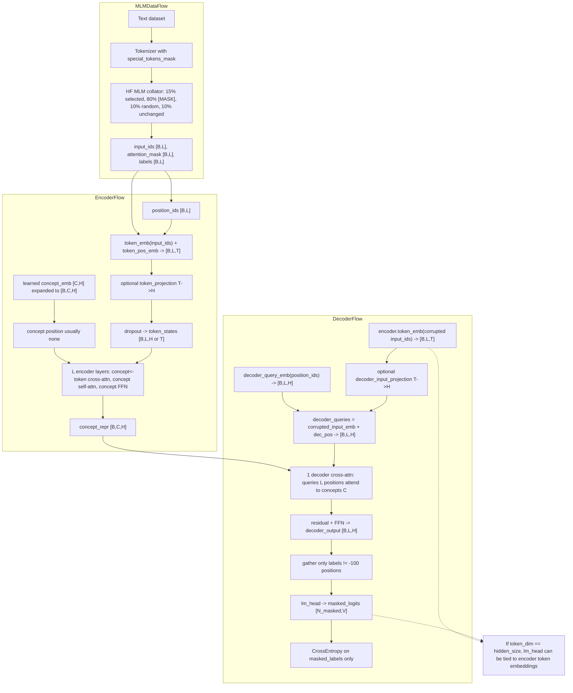
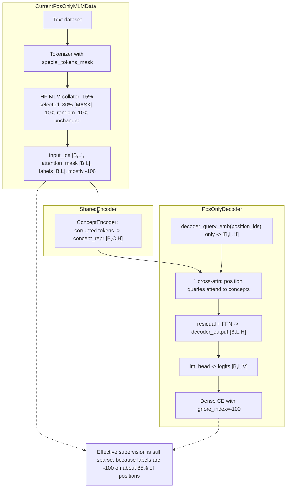
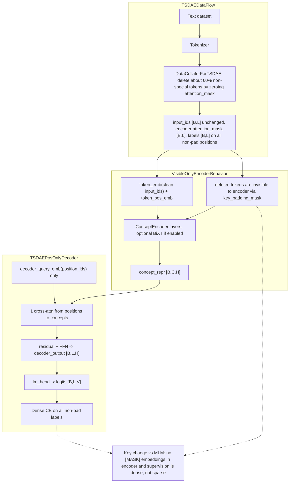
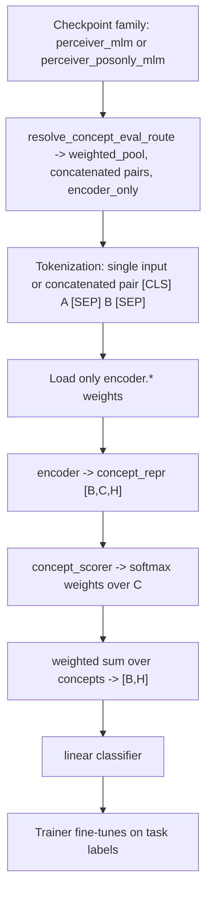
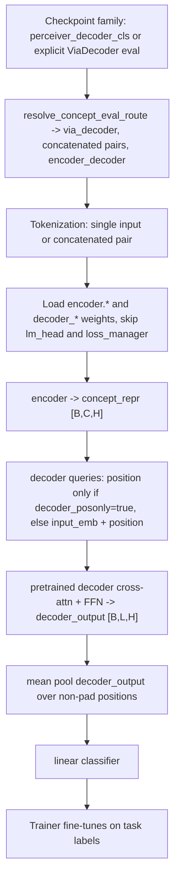
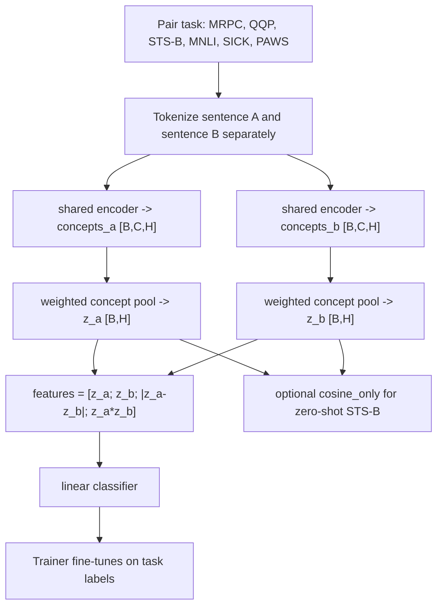

# MLM Failure Analysis: Why Perceiver MLM Underperformed and What Was Missed

**Date:** 2026-03-08  
**Author:** Krzysztof Sopyla / AI research analysis session  
**Status:** Permanent research note

**Why this report was created:**
- MLM remains the strongest concept-encoder line numerically, so it should not be abandoned without a deeper re-derivation of why it stalled.
- The earlier MLM note was useful, but a fresh analysis was needed from the current code, training scripts, evaluation stack, experiment history, and external literature rather than from prior conclusions alone.
- Since the diffusion and prefix branches received several rounds of engineering hardening that MLM did not, this report exists to separate true MLM architectural/objective failure from evaluation and research-loop distortions.

**Related previous MLM diagnosis report:**
- [mlm_perceiver_diagnosis_20260221.md](mlm_perceiver_diagnosis_20260221.md) — important historical note; referenced only at the end for compare-back, not used as the starting point for the main conclusions here.

**Related recent diagnosis report:**
- [diffusion_failure_analysis_20260307.md](diffusion_failure_analysis_20260307.md)

**Primary code audited:**
- `nn/concept_encoder.py`
- `nn/concept_encoder_perceiver.py`
- `nn/concept_encoder_weighted.py`
- `training/train_mlm.py`
- `training/train_perceiver_denoise.py`
- `data/dataset_preprocess.py`
- `data/data_collators.py`
- `evaluation/concept_eval_routing.py`
- `evaluation/evaluate_model_on_glue.py`
- `evaluation/evaluate_on_benchmark.py`
- `scripts/train_perceiver_denoise_multigpu.sh`
- `scripts/train_prefix_diffusion_multigpu.sh`
- `scripts/evaluate_concept_encoder_glue.sh`
- `scripts/evaluate_concept_encoder_glue.ps1`

**Primary project evidence:**
- [roadmap.md](../1_Strategy_and_Plans/roadmap.md)
- [active_todos.md](../1_Strategy_and_Plans/active_todos.md)
- [master_experiment_log.md](../2_Experiments_Registry/master_experiment_log.md)
- [via_decoder_eval_20260222.md](../2_Experiments_Registry/run_reports/via_decoder_eval_20260222.md)

**External references consulted:**
- Perceiver IO / `deepmind/language-perceiver`
- MAE-LM / Representation Deficiency in MLM
- TSDAE
- BiXT
- Poly-encoder / sentence-pair semantic matching literature

---

## 1. Executive Summary

The main conclusion from this fresh pass is:

**The MLM branch did not fail because concept bottlenecks are inherently wrong. It underperformed because the project combined an under-contextualized encoder, an uneven decoder objective, and an evaluation path that often measured the wrong parts of the pretrained system.**

More precisely:

1. **The encoder is too weak before compression.**  
   In the standard MLM path, token states are computed once and then reused across all encoder layers unless `use_bixt=True`. Concepts repeatedly attend to mostly static token+position embeddings instead of evolving contextual token states.

2. **The two MLM perceiver variants are wrong in opposite ways.**
   - `perceiver_mlm` is **too easy in the wrong way** because decoder queries include token embeddings plus position.
   - `perceiver_posonly_mlm` is **too hard in the wrong way** when trained through `train_mlm.py`, because it removes the shortcut but still receives sparse 15% MLM supervision with only a 1-block decoder.

3. **The downstream evaluator often discards the module that pretraining actually taught.**  
   The default route for `perceiver_mlm` and `perceiver_posonly_mlm` is `weighted_pool` + `encoder_only`, which drops the pretrained decoder even though MLM pretraining optimized the encoder+decoder pair jointly.

4. **The research loop favored the wrong winner.**  
   MLM training chooses checkpoints by `eval_loss`, which naturally favors the shortcut-friendly `perceiver_mlm`. Downstream evaluation then mostly tests encoder-only transfer, which further favors the same variant.

So the correct reading is not:

> MLM concept encoding failed.

It is:

> The current MLM recipe and evaluation loop are misaligned. MLM likely learned more than the default metrics revealed, but the bottleneck was not forced to carry semantics robustly enough, and the best semantic readouts were not used consistently.

---

## 2. Phase 1: Tensor Flow Diagrams

### 2.1 `perceiver_mlm` as actually trained now



**Key observation:** the encoder sees corrupted MLM input, token states do not update across layers by default, and the decoder query contains token identity plus position.

---

### 2.2 `perceiver_posonly_mlm` as actually trained now through `train_mlm.py`



**Key observation:** this model is cleaner than normal MLM, but it is still being trained under sparse HF MLM corruption, not under the dense denoising setup it was really designed for.

---

### 2.3 PosOnly under its intended TSDAE path



**Key observation:** same PosOnly decoder family, but now the encoder sees clean visible tokens and the loss hits the full sequence. This is a materially different training signal.

---

### 2.4 Sequence classification via `weighted_pool`



**Key observation:** this is the default route for both MLM perceiver families, and it discards the pretrained decoder entirely.

---

### 2.5 Sequence classification via `ViaDecoder`



**Key observation:** this is the only route that tests whether the pretrained decoder learned something useful.

---

### 2.6 Separate sentence-pair classification



**Key observation:** this is the cleanest semantic route for pair tasks, but it is not the default route for MLM-family checkpoints.

---

## 3. Root Cause Audit

## 3.1 What is a real architectural/objective problem

### 1. The encoder compresses mostly static token memories, not evolving contextual token states

In `ConceptEncoder.forward()`:

- token embeddings are computed once,
- then reused in every layer,
- unless `use_bixt=True`.

So the default L6 encoder is not a 6-layer contextual token encoder followed by concept compression. It is closer to:

> 6 rounds of concept refinement over a mostly fixed lexical-position memory bank.

This is the single most fundamental bottleneck.

**Why it matters:** semantic roles, negation, clause structure, and pairwise reasoning normally emerge from token-token contextualization. Here, concepts must infer them directly from raw token embeddings plus absolute positions.

---

### 2. `perceiver_mlm` is too easy in the wrong way

In `ConceptEncoderForMaskedLMPerceiver.forward()`, decoder queries are:

```python
decoder_queries = input_embeddings + pos_embeddings
```

So the decoder starts with:
- lexical identity from corrupted `input_ids`,
- plus positional identity,
- plus one cross-attention read from concepts.

This creates a shortcut-prone regime:
- the model can reduce MLM loss without forcing concepts to become rich semantic variables,
- especially when `token_embedding_dim == hidden_size` and `lm_head` can be tied to token embeddings.

**Important nuance:** this does not fully bypass concepts for masked positions, but it makes the bottleneck less necessary than desired.

---

### 3. Current `perceiver_posonly_mlm` is too hard under sparse MLM supervision

PosOnly removes the query shortcut, which is directionally correct.

But under `train_mlm.py`, it still receives:
- sparse MLM labels at roughly 15% of positions,
- encoder inputs polluted by `[MASK]`/random corruption,
- only one decoder cross-attention block plus FFN.

So the current comparison is unfair:
- `perceiver_mlm` is easy and shortcut-friendly,
- `perceiver_posonly_mlm` is clean but under-supervised.

This is a major missed point in the original research loop.

---

### 4. `[MASK]`-style corruption pollutes the encoder

The encoder consumes the post-collator `input_ids`, so concept extraction is performed over sequences containing `[MASK]` and random replacements.

MAE-LM argues this creates a representation deficiency because hidden-space capacity gets spent on special corruption tokens that do not appear at downstream time.

This matters more in a concept bottleneck than in full-sequence BERT-style encoders, because only 128 concept slots are available to store useful structure.

---

### 5. Concept slots are too symmetric

In the canonical MLM launcher:

- `CONCEPT_POSITION_TYPE="none"`
- no slot competition mechanism,
- no slot identity,
- no specialization pressure beyond the task loss and optional regularization.

That makes reuse and duplication cheap. Collapse into a few dominant directions is therefore unsurprising.

---

### 6. The decoder is too shallow for both variants

Both perceiver MLM decoders are basically:
- one cross-attention block,
- one FFN,
- no iterative refinement.

That is likely:
- too permissive in normal MLM,
- too weak in PosOnly MLM.

PosOnly especially would be expected to need a deeper decoder if it is to reconstruct from concepts without a lexical shortcut.

---

## 3.2 What is likely mismeasured rather than truly failed

### 1. The default MLM-family GLUE route discards the pretrained decoder

`evaluation/concept_eval_routing.py` routes both `perceiver_mlm` and `perceiver_posonly_mlm` to:

- `model_mode="weighted_pool"`
- `load_mode="encoder_only"`
- concatenated pair inputs

So the default evaluator is mostly measuring encoder transfer, not the full pretrained encoder+decoder system.

That is a central reason the MLM line may look worse than it really is.

---

### 2. The main L6 PosOnly checkpoint may never have received a correct ViaDecoder evaluation

`ConceptEncoderForSequenceClassificationViaDecoder` now supports `decoder_posonly`, but this was added later for backward compatibility.

That means older PosOnly checkpoints can silently default to non-PosOnly decoder behavior unless their config is corrected.

So the current evidence against PosOnly is weaker than it appears.

---

### 3. The planned MLM separate-pair route is missing in practice

The roadmap and todos explicitly expect a `perceiver_pair_cls` evaluation path, and `CHANGELOG.md` records it as added.

But the current `evaluation/evaluate_model_on_glue.py` CLI choices do not expose `perceiver_pair_cls`.

So one of the intended semantic readouts for MLM checkpoints currently appears unavailable in the live evaluator.

---

### 4. Some evaluation entrypoints are stale or misleading

The Windows wrapper `scripts/evaluate_concept_encoder_glue.ps1` hardcodes:
- `weighted_mlm`
- `bert-base-cased`

So on Windows it can easily evaluate a checkpoint using the wrong model family and tokenizer assumptions.

The Linux wrapper is better, but still contains an outdated note saying `perceiver_mlm` and `perceiver_posonly_mlm` use the same classification head and differ only during pretraining. That is exactly the assumption the later ViaDecoder work was meant to challenge.

---

### 5. The experiment loop favored the wrong winner

The canonical MLM training launcher selects the best checkpoint by `eval_loss`.

That naturally favors:
- the easier-to-optimize `perceiver_mlm`,
- not necessarily the most semantically useful checkpoint.

Then downstream evaluation mostly uses `weighted_pool` + `encoder_only`, which again favors checkpoints whose benefit lives in the encoder alone.

This means the full research loop was structurally biased toward the shortcut-friendly variant.

---

## 4. Comparison to External Papers and Code

| Reference | Relevant design choice | Why it matters here |
|---|---|---|
| Perceiver IO / `deepmind/language-perceiver` | decoder queries are defined independently of raw input identity; deep latent processing; much larger scale | your setup is shallower and less protected by scale, so shortcut and weak compression effects matter more |
| MAE-LM | exclude masked tokens from encoder input | directly supports visible-only encoding instead of `[MASK]`-polluted concept extraction |
| TSDAE | dense denoising reconstruction from a bottlenecked representation | better fit for forcing semantic compression than sparse MLM |
| BiXT | tokens and latents update each other simultaneously | direct fix for the static token-memory problem |
| Poly-encoder / semantic matching literature | separate encoding can be a better inductive bias than concatenated pairs for semantic matching | supports the sentence-pair classification direction and weakens conclusions from concatenated-only pair evaluation |

### Main external differences vs this project

1. **Perceiver-style success in public code is not based on a shallow one-block decoder plus weak supervision.**
2. **MAE-LM directly supports the idea that corruption tokens should not pollute the encoder.**
3. **TSDAE supports dense denoising over sparse masking when semantic embeddings are the goal.**
4. **BiXT exists precisely to fix the token-latent co-evolution problem that standard Perceiver-like encoders suffer from.**
5. **Semantic matching literature supports separate-sentence routes as meaningful measurements, not niche extras.**

---

## 5. Ranked Root Cause Tree

### Primary cause A — Weak encoder before compression
The default encoder compresses mostly static token+position embeddings into concepts. This is the most fundamental architectural bottleneck and likely the largest single cause of semantic underperformance.

### Primary cause B — The two MLM variants are mis-specified in opposite directions
- `perceiver_mlm`: too easy in a shortcut-friendly way.
- current `perceiver_posonly_mlm`: too hard under sparse MLM supervision.

This means the project compared the wrong two points on the design space.

### Primary cause C — The evaluator often measures the wrong system
Default MLM-family evaluation drops the pretrained decoder and keeps concatenated pair routing, which can hide real semantic gains or decoder-specific benefits.

### Secondary cause D — `[MASK]`-polluted encoder inputs
This wastes scarce bottleneck capacity and encourages non-semantic coding.

### Secondary cause E — Slot symmetry and anonymous concept identities
The concept bank is too exchangeable by default, making duplicate or low-rank solutions cheap.

### Secondary cause F — Decoder too shallow
One cross-attention block plus FFN is not a strong enough interface for clean concept-only decoding.

### Tertiary cause G — Scale and from-scratch burden
The model is learning language understanding, slot specialization, and compression at once from scratch on Minipile. This amplifies the other problems but is probably not the deepest root cause.

---

## 6. What Was Missed

The most important missed point is:

**The project mixed true representation failure with evaluation-contract failure, and that especially obscured the real status of PosOnly MLM.**

The earlier work correctly identified several structural misalignments, but this fresh pass adds a stronger conclusion:

> Some of the apparent MLM failure is not representation failure at all. It is a measurement failure caused by defaulting to encoder-only weighted-pool evaluation, not preserving decoder metadata for older checkpoints, and not consistently exposing the planned separate-pair evaluation route.

That does not rescue the current MLM setup, but it does change how strongly we should interpret its historical results.

---

## 7. Fix Ladder and Recommended Experiment Order

## 7.1 Highest-priority: no-code or almost-no-code reevaluations

1. Re-evaluate the canonical L6 `perceiver_mlm` checkpoint under:
   - `weighted_pool`
   - `ViaDecoder`
   - separate-pair route if restored
   - zero-shot STS-B

2. Re-evaluate the canonical L6 `perceiver_posonly_mlm` checkpoint with the correct `decoder_posonly` semantics and the same evaluation set.

3. Treat old PosOnly conclusions as provisional until this is done.

---

## 7.2 Bring MLM up to parity with the hardened diffusion/prefix stack

1. Save evaluation-contract metadata in MLM checkpoints:
   - `checkpoint_family`
   - `evaluation_contract_version`
   - `canonical_pair_eval_mode`
   - `canonical_single_eval_mode`
   - `pretraining_objective`

2. Expose `use_bixt` and `bixt_token_ffn` in `train_mlm.py`.

3. Expose reduced `token_embedding_dim` in the canonical MLM launcher.

4. Stop defaulting the MLM launcher to legacy `combined` regularization.

5. Restore the missing `perceiver_pair_cls`-equivalent route in the live evaluator.

---

## 7.3 Minimal MLM architecture/objective repairs

1. **MLM + BiXT**
   - strongest first repair,
   - directly fixes static token memory.

2. **MLM + reduced token width**
   - `token_embedding_dim=64` or `32`,
   - reduces cheap lexical hashing capacity.

3. **MAE-LM-style visible-only encoder**
   - keep MLM-like targets,
   - remove `[MASK]` pollution from encoder input.

4. **Deeper PosOnly decoder**
   - 2-3 decoder layers,
   - ideally with iterative refinement.

5. **Add slot identity**
   - test `concept_position_type="sinusoidal"` and `"learned"`.

---

## 7.4 Broader experiments if MLM v2 still underperforms

1. TSDAE + BiXT  
2. Warm-start from a pretrained backbone  
3. Span corruption / UL2-style denoising mixtures  
4. Slot Attention if collapse remains severe

---

## 8. Compare-Back to the Old MLM Note

This section references [mlm_perceiver_diagnosis_20260221.md](mlm_perceiver_diagnosis_20260221.md) explicitly, but only after finishing the fresh analysis above.

### What the fresh pass confirms

The old note was directionally correct about:
- `[MASK]` pollution,
- static token embeddings across encoder layers,
- decoder input-embedding shortcuts,
- classification-head mismatch,
- the value of separate sentence encoding.

### What the fresh pass changes or adds

1. **Evaluation-contract problems are bigger than the old note captured.**  
   The fresh pass shows that decoder-dropping evaluation, PosOnly checkpoint compatibility, stale wrappers, and the missing live `perceiver_pair_cls` path materially distort the interpretation of historical MLM results.

2. **PosOnly is more underdetermined than the old note implied.**  
   The old diagnosis pushed PosOnly in the right conceptual direction, but the current evidence is still too weak to call historical PosOnly a clean failure, because it was likely trained under the wrong supervision regime and never fully re-measured with the right route.

3. **The experiment-selection loop itself was biased.**  
   Choosing winners by MLM `eval_loss` and then evaluating them mostly with encoder-only weighted-pool routes strongly favors `perceiver_mlm`, even if it learns the wrong internal solution.

### One thing to weaken from the old note

The exact numeric certainty around the very large effective-gradient multiplier should be treated cautiously. The qualitative point is strong and still valid:

- sparse MLM gives much weaker semantic pressure than dense reconstruction,
- and attention distributes gradient across concepts.

But the fresh pass is more confident in the structural diagnosis than in any one exact multiplier.

---

## 9. Final Conclusion

The right conclusion is not:

> MLM concept encoding failed.

It is:

> The current MLM perceiver recipe and evaluation loop are misaligned. The encoder is too weak before compression, the normal decoder is shortcut-friendly, the current PosOnly MLM path is under-supervised, and the default evaluator often under-measures what the pretrained system actually learned.

This means the MLM line still deserves a corrected second pass.

If that second pass still fails after:
- proper decoder-aware reevaluation,
- separate-pair measurement,
- BiXT,
- reduced token width,
- and visible-only / denoising-style encoder corruption,

then the case against MLM will be much stronger. Right now, it is not yet strong enough.
