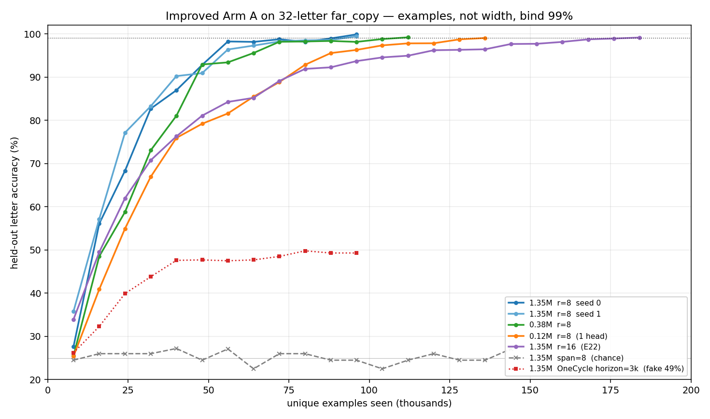

# Improved Arm A on `far_copy`: what it takes to hit ~100% (2026-09-13)

**Class:** dated measurement (append-only). CPU only. Follows
[the cold-start note](concept_channel_cold_start_20260913.md).
**Instrument:** `verification/symbolic_channel_probe.py`, warm init `0.02` on both
`pooler.wo` and `xattn.wo`, `concept_xattn_scope=exclusive`.

## The exam (frozen)

- 128-token rows, 4-symbol alphabet, a **32-letter span** planted ≥32 tokens before the answer
- decoder raw window = 32, so the span is invisible as text
- 16 slots at `r=8` (the span occupies 4 of them); `r=16` is the E22 ratio (8 slots, span occupies 2)
- “100%” here means **≥99% of the 32 answer letters** on 128 held-out rows (4096 letters).
  Seed 0 reached **99.88%** (five mistakes).

Arm D (full page, no notebook) already solves this at 100%. The question is only: **what does
the notebook student need?**

## The number that was wrong yesterday

The 3000-step orange curve that stalled at **49%** was not a capacity wall. It was
**OneCycleLR with horizon = 3000**: the learning rate died while the student was still
learning the copy rule. The same 1.35M model, same 3000 steps, with a *longer* OneCycle
horizon (12k, stop when accurate) reaches **99.9%**. The updates were enough; the schedule
was not.

## Exact limits (all improved Arm A, CPU, 2 threads)

| knob | params | examples to ≥99% | steps (batch 32) | supervised letters seen | wall | accuracy |
|---|---|---|---|---|---|---|
| width 128, `r=8`, seed 0 | **1.35M** | **96,000** | 3,000 | 3.07M | ~13 min | **99.88%** |
| same, seed 1 | 1.35M | **96,000** | 3,000 | 3.07M | ~14 min | **99.44%** |
| width 64 | **0.38M** | 112,000 | 3,500 | 3.58M | ~8 min | 99.19% |
| width 32 (1 head) | **0.12M** | 136,000 | 4,250 | 4.35M | ~4 min | 99.05% |
| `r=16` (E22 compression) | 1.35M | **184,000** | 5,750 | 5.89M | ~25 min | 99.15% |
| span=8 (8× less loss per row) | 1.35M | >96,000 | — | — | — | **25% (chance)** |
| OneCycle horizon=3k | 1.35M | 96,000 wasted | 3,000 | 3.07M | ~8 min | **49%** |

Arm D on the same exam: **0.60M params, ~64k examples, 100%**, ~2 min. So the notebook student
needs **~1.5× the examples** and about **5× the wall-clock** (the encoder+pooler+latent+cross-attn
is slower per step: 0.25 s vs 0.07 s).

Taking the notebook away after 99.9%: accuracy **24.8%**, CE 7.15. The skill is entirely in
the array.

## What each knob actually did

**Examples (the binding knob, once the schedule lives long enough).**
Accuracy is a smooth function of unique rows seen. Both seeds cross 99% at the *same* 96k.
56k examples is already 98%. The remaining 1–2% is polishing.

**Capacity (not binding above ~0.12M).** A 120k-parameter model still hits 99%. It wants
~40% more examples, not a different architecture. This exam is a 64-bit copy through 4 slots;
a 32-wide residual stream is plenty.

**Compression `r`.** Doubling the pooling ratio (`r=16`, E22’s number) does **not** make the
task impossible. It costs **~1.9× examples** (184k vs 96k). The array still carries a
32-letter string when each slot summarises 16 letters instead of 8.

**Supervision density (can make the exam unsolvable at this budget).** Copying **8** letters
instead of 32, same model, 96k examples: stuck at chance. The channel gets 8× fewer loss
tokens per row, and the span is one slot instead of a four-slot blob. “Easier looking”
was the harder task. For a probe, **pack the loss**: long copies teach the read faster than
short ones.

**Compute** is not a third independent axis here. At this size it is almost `examples ×
cost-per-example`. Cost-per-example scales with width (0.06 s/step at 0.12M, 0.25 s/step at
1.35M). Hitting 99% at 1.35M is ~750 seconds on 2 CPU threads; at 0.12M it is ~250 seconds
even though more examples are needed, because each step is cheaper.

## Protocol rules this writes down

1. **Never set the LR horizon to the expected finish.** If 99% arrives around step 3k, give
   OneCycle 8–12k and early-stop. A 3k horizon produced a fake 49% ceiling.
2. **Score ≥99% on a long copy**, not a 1-token key. Short answers starve the channel.
3. **Always ablate the array** on the 99% checkpoint. If accuracy does not fall to chance,
   the decoder found a leak.
4. This 100% is **not** a language result. It says the exclusive-scope notebook can
   losslessly carry 64 bits across a 32-token gap in a 128-token row, at ≤0.12M parameters
   and ~10^5 examples. E23 on 32k text is a different prize.

## What to do on GPU next (if we want the 32k version of this)

Keep the exam, stretch the gap:

- `seq_len=32768`, `dec_segment=1024`, `min_gap=4096`, `span_len=32`, `r=16`
- start from the 1.35M recipe (it already 99%s at `r=16` on the toy gap)
- budget: if example-count scaled with gap (unknown — may not), 184k × 256× longer rows is
  GPU work; more likely the *rule* transfers and example-count stays ~10^5, only FLOPs
  per example grow. That is the first GPU measurement: **does 99% still arrive near 10^5
  examples when the gap is 4k not 32?**
